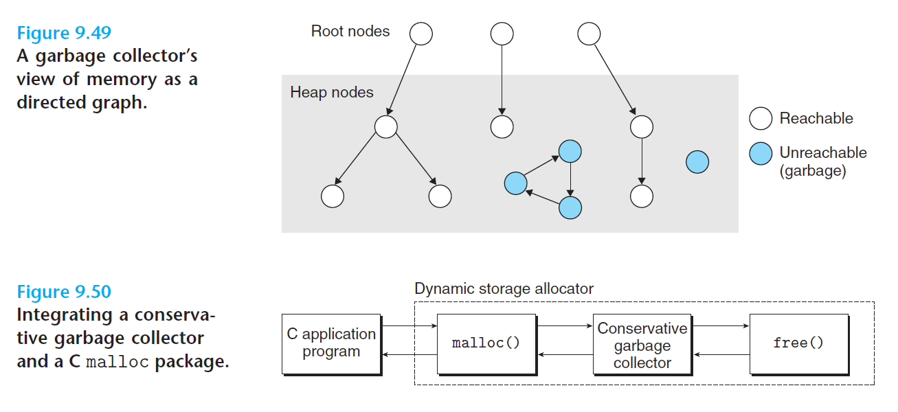

# Ch9 VM as a Tool for Caching

## 9.10 Garbage Collection

垃圾收集器：动态内存分配器，自动释放程序不再需要的已分配块。

### 9.10.1 Garbage Collector Basics

垃圾收集器将内存视为一张有向可达图，根节点对应于一种不在堆中的位置，指向堆中的指针，这些位置可以是寄存器、栈中的变量，或者是虚拟内存读写数据区域内的全局变量。

但存在一条从任意根节点出发并到达 p 的有向路径时，p 节点是可达的。不可达节点即为垃圾，垃圾收集器是维护可达图的某种表示，通过释放不可达节点并将其返回给空闲链表，进行定期回收。

关键思想：代替应用程序进行 free 操作。

