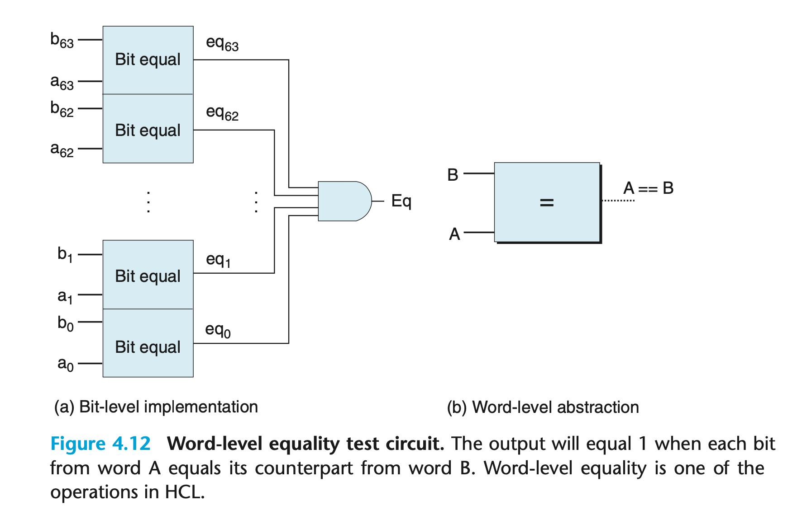
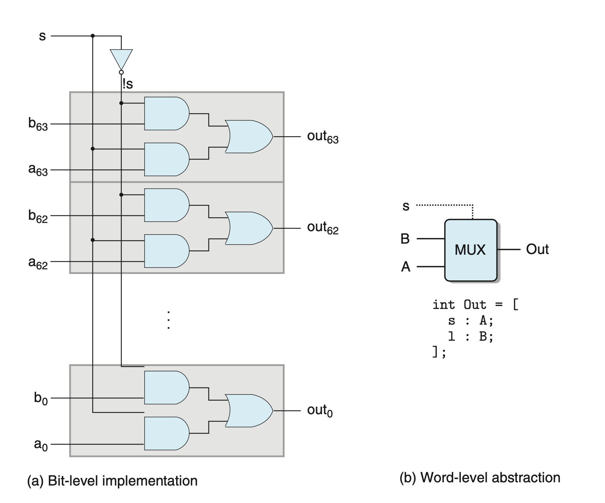
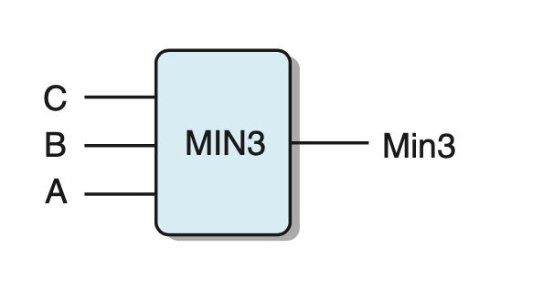
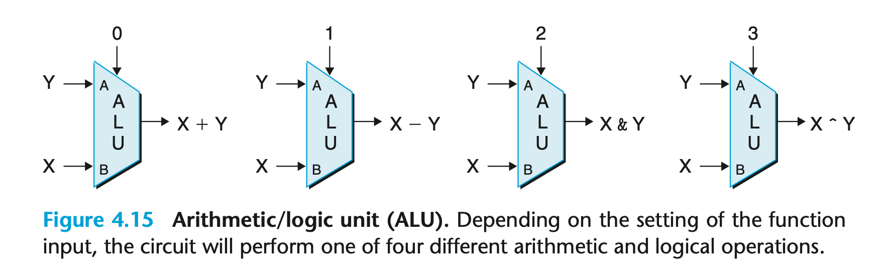

# 4.2.3 Word-Level Combinational Circuits and HCL Integer Expressions
通过组合大量的逻辑门，我们可以得到拥有复杂计算功能的组合电路。
我们的处理器会处理4到64位不等的字，用于标记整型、地址、操作符和寄存器。


图为一个比较两个64位整型是否相等的组合电路。
写成 HCL 非常简单。
```
bool Eq = (A == B);
```

另一个多路选择器的例子。


HCL也有case表达式。
但写HCL的时候并不要求不同的case不冲突；但在电路实际实现的时候，还是需要不冲突的。电路分析器会实现相应的翻译工作。
```
word Out = [
          s: A;
          1: B;
];
```
就表示，如果没有命中s，就应该输出 B。

最后一个例子。
```
word Min3 = [
        A <= B && A <= C : A;
        B <= A && B <= C : B;
        1                : C;
];
```


总结一下，组合电路可以在 word-level 上处理不同的操作。
ALU 算数逻辑单元 可以被抽象为下面这样。



