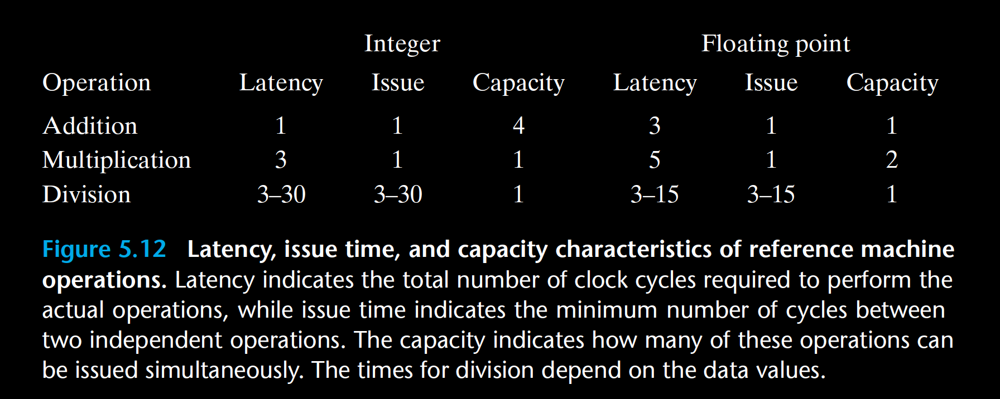

The most common mechanism for controlling the communication of operands   among the execution units is called register renaming. When an instruction that   updates register   r   is decoded, a tag   t   is generated giving a unique identifier to   the result of the operation. An entry   (r, t)   is added to a table maintaining the   association between program register   r   and tag   t   for an operation that will update   this register. When a subsequent instruction using register   r   as an operand is   decoded, the operation sent to the execution unit will contain   t   as the source   for the operand value. When some execution unit completes the first operation,   it generates a result   (v, t)  , indicating that the operation with tag   t   produced   value   v  . Any operation waiting for   t   as a source will then use   v   as the source   value, a form of data forwarding. By this mechanism, values can be forwarded   directly from one operation to another, rather than being written to and read from   the register file, enabling the second operation to begin as soon as the first has   completed. The renaming table only contains entries for registers having pending   write operations.When a decoded instruction requires a register   r  , and there is no   tag associated with this register, the operand is retrieved directly from the register   file. With register renaming, an entire sequence of operations can be performed   speculatively, even though the registers are updated only after the processor is   certain of the branch outcomes. 

