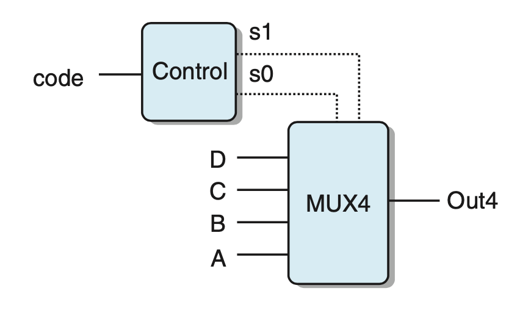
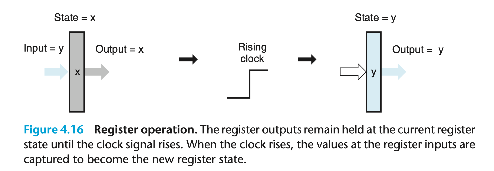
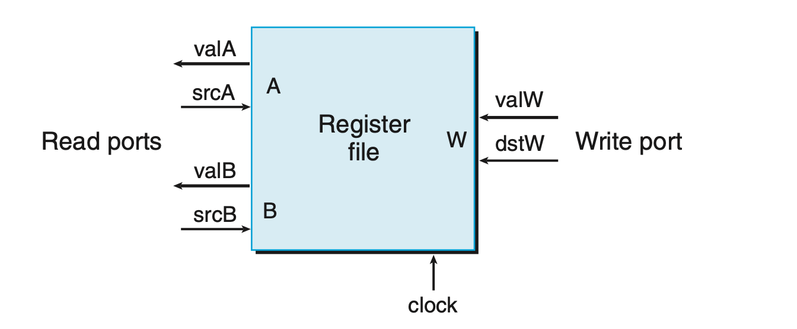
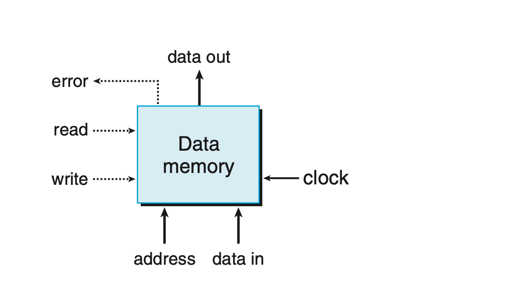

# 4.2.4 set membership
`集合关系`在数字电路中是常有的，即考察信号是不是满足一组可能的匹配值。

比如在这个多路选择器中，code对应的s1和s2信号可以写成如下表达式：
```
s1 = code == 2 || code == 3
s2 = code == 1 || code == 3
```
更简短的方式则是
```
s1 = code in {2, 3}
s2 = code in {1, 3}
```

```
iexpr in {iexpr1, iexpr2, . . . , iexprk}
```

# 4.2.5 Memory and Clocking
组合电路本身是不含状态的，只是从输入到输出的映射而已。
为了做复杂计算，我们需要时序的状态，因此需要 memory 和 clocking。后者用于控制前者，决定什么时候将数据存储下来。

值只在时钟信号上升沿才会从寄存器传递出去；是组合电路中的 barrier 。


这是一个典型的 register file 的例子；有两个输出一个输入，可以同时读写。
输入 srcA 地址，可以读出 valA。
每次上升沿的时候，valW 也会被写入地址 dstW。 register file 通常还有地址检查，用逻辑电路即可完成，越界则输出 error。

内存结构如下：

read 和 write 则不能同时进行，只有一个引脚为高电平。
通常的系统中，内存会有两个部分，一个读指令；另一个读写数据。


