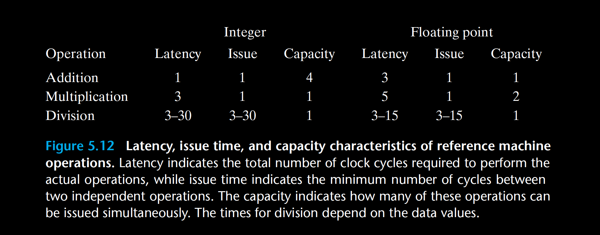

 Circuit designers can create functional units with wide ranges of performance characteristics. Creating a unit with short latency or with pipelining requires more hardware, especially for more complex functions such as multiplication and floating-point operations. Since there is only a limited amount of space for these units on the microprocessor chip, CPU designers must carefully balance the number of functional units and their individual performance to achieve optimal overall performance. They evaluate many different benchmark programs and dedicate the most resources to the most critical operations. As Figure 5.12 indicates, integer multiplication and floating-point multiplication and addition were considered important operations in the design of the Core i7 Haswell processor, even though a significant amount of hardware is required to achieve the low latencies and high degree of pipelining shown. On the other hand, division is relatively infrequent and difficult to implement with either short latency or full pipelining. 

