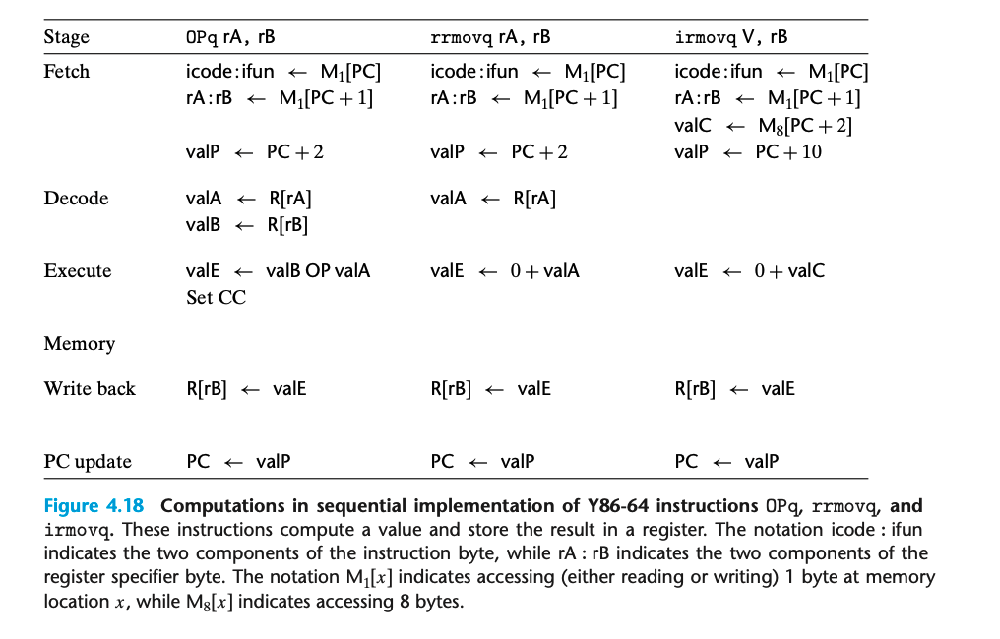

### 4.3.1 Organizing Processing into Stages

在简化的处理中，有一个循环，执行这些不同的阶段；如果出现异常直接停止。
一个指令执行的步骤其实是比较丰富的。好在整体流程比较相似的；通过设计，我们还是可以将系统映射到集成电路的表面。
尽可能使得更多不同的指令共享同样的硬件；重复的硬件成本比重复的代码成本高的多。

这是不同指令和执行过程的关系。

这也是为什么 addq subq andq xorq 这几个指令的 icode 是一样的；因为他们有着一致的流程，只是 ALU 计算的时候不同而已。

