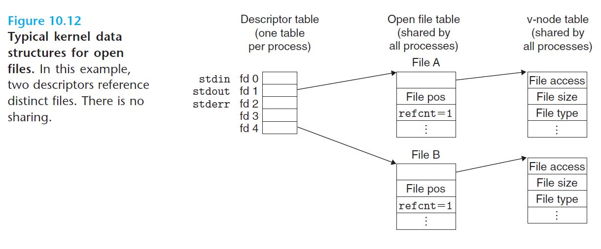

# Ch10 System-Level I/O

## 10.8 Sharing Files

内核用三个相关的数据结构来表示打开的文件：

* 描述符表（descriptor table）：每个进程都有其独立的描述符表，表项由进程打开的文件描述符来索引的。
* 文件表（file table）：所有的进程共享这张表，每个文件表的表项包括当前文件的位置、应用计数、一个指向 v-node 表中对应表项的指针。
* v-node 表（v-node tanle）：同文件表一样，所有的进程共享这张 v-node 表。

