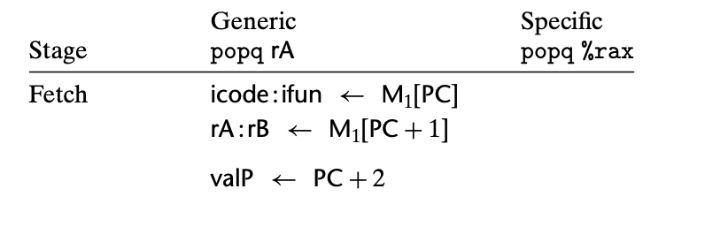
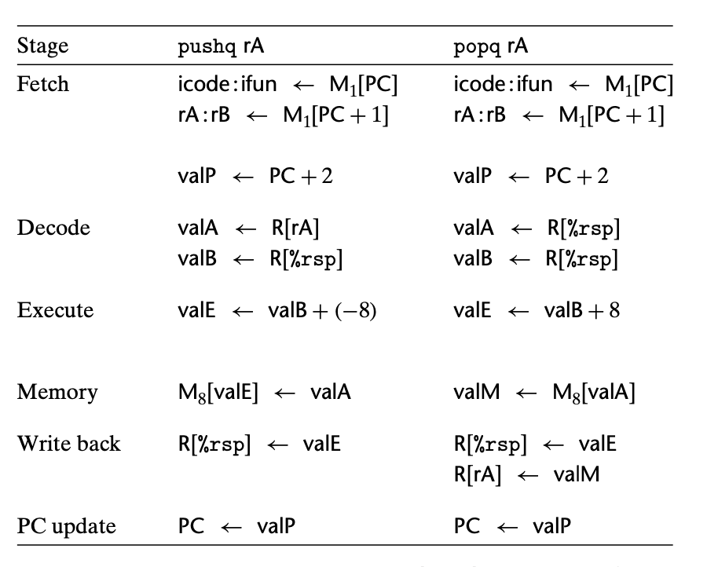

### 4.3.1 Organizing Processing into Stages

pushq 和 popq 是其中最复杂的部分；因为同时涉及 accessing memory 和 incrementing or decrementing stack pointer.

pushq：
execute 阶段用 ALU 减少 stack pointer。 在 write-back 阶段会写回寄存器； memory 阶段则根据 rsp 写 valA 进内存。

popq 与之非常相似。在 Decode 阶段对 rsp 读了两份拷贝，这是为了流程与其他指令更加相似。这样 execute 阶段更新了 rsp，我们还可以用未增加的rsp的值作为地址去访问内存。
