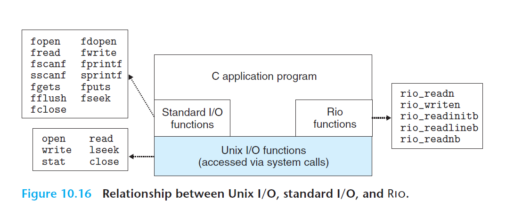

# Ch10 System-Level I/O

## 10.11 Putting It Together: Which I/O Functions Should I Use?

使用 I/O 函数的原则：

1. 尽可能使用标准 I/O
2. 不要使用 scanf 来读取二进制文件
3. 网络套接字使用 RIO

标准 I/O 流本质上时全双工的，相关限制：

1. 跟在输出函数之后的输入函数。如果中间没有插入对 fflush、fseek、fsetpos 等函数调用，一个人输入函数不能跟随在一个输出函数之后。
2. 跟在输入函数之后的输出函数。同上。

