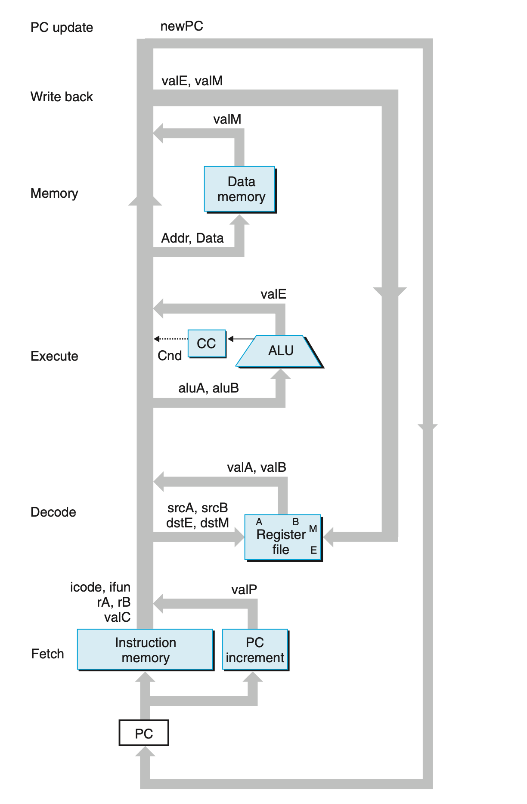

### 4.3.2 SEQ Hardware Structure

6个基本阶段： fetch decode execute memory write-back PC-update

不同的阶段采用不同的硬件单元处理。 SEQ模型下，所有所有处理都需要一个时钟周期。

列举一些重要的硬件模块
Write back 阶段 register file 的 Port E 用于写入 ALU 计算得到的值； Port M 则用于写入从 memory 中读取的值。