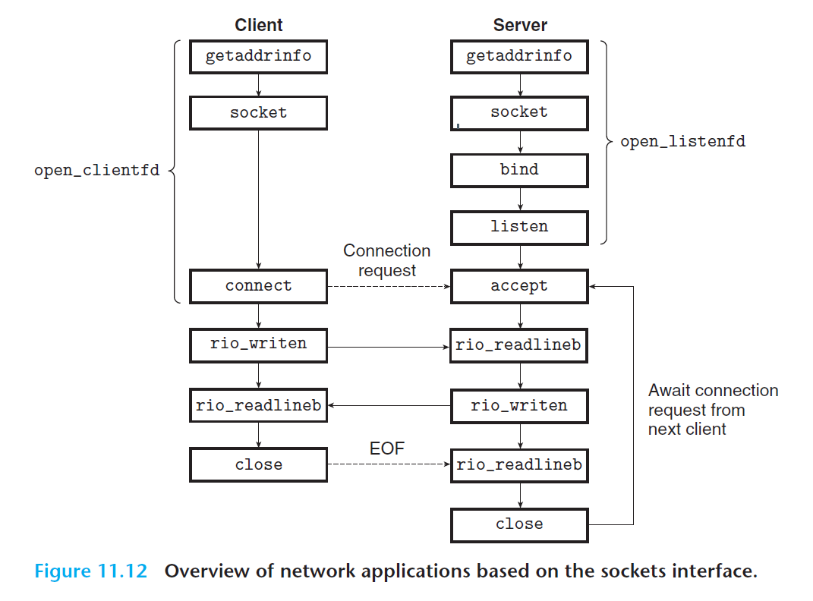
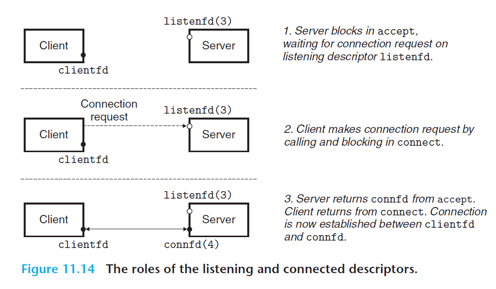

# Ch11 Network Programming

## 11.4 The Sockets Interface

套接字 API：

监听套接字和链接套接字的区别：

连接中的 EOF 代表着：EOF 是内核检测到的一种条件，应用程序在它接到一个由 read 函数返回的零返回码时，其会发现出 EOF 条件。在套接字连接中，当进程关闭连接它的那一端时，就会发生 EOF，连接另一端的进程试图读取套接字最后一个字节时，会检测到 EOF。

