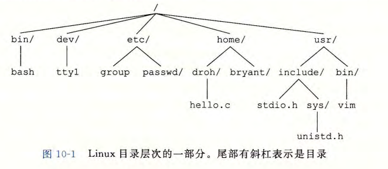
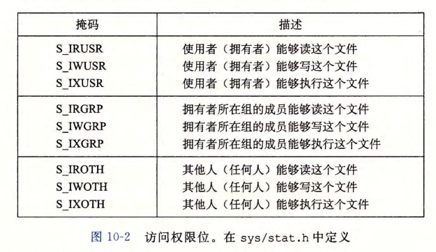

## 第三部分 程序间的交互和通信

目标：了解UNIX操作系统提供的基本`I/O`服务。

> 例：Web客户端和服务器，通过Internet彼此通信。

### 第 10 章：系统级`I/O`

含义：输入/输出(`I/O`)是在主存和外部设备(磁盘驱动器、终端和网络之间复制数据的过程)。

> 输入：从I/O设备复制数据到主存；
>
> 输出：从主存复制数据到`I/O`设备；

所有语言的运行时系统都提供执行I/O较高级别的工具。

> 例：ANSI C提供标准`I/O`库，包含`printf`或`scanf`这样执行带缓冲区的I/O函数。
>
> C++语言用它的重载操作符`<<`(输入)和`>>`(输出)提供了类似的功能。
>
> Linux系统中，通过使用内核提供的系统级`Unix I/O`函数实现这些较高级别的`I/O`函数。

学习`Unix I/O`好处：

1. 理解其它系统概念。
2. 没有选择的选择。

#### 10.1 Unix I/O

一个`Linux`文件就是一个$m$个字节的序列：
$$
B_0,B_1,...,B_k,...,B_{m-1}
$$
`Unix I/O`：所有的`I/O`设备(网络、磁盘和终端)都被模型化为==**文件**==，所有输入和输出都被当作相应文件的读和写执行。这种将设备映射为文件的方式，允许`Linux`内核引出简单、低级的应用接口，即是`Unix I/O`。

这使得输入和输出都能以一种统一方式执行：

1. **打开文件**。一个应用程序通过要求内核打开相应的文件，宣告它想访问一个`I/O`设备。内核返回一个小的非负整数，叫做**描述符**，它在后续对此文件的所有操作中标识这个文件。内核记录有关这个打开文件的所有信息。应用程序只需记住这个描述符。

   概念：描述符。

2. `Linux shell`创建的每个进程开始时都有三个打开的文件：**标准输入**(描述符是0)、**标准输出(**描述符是1)和**标准错误**(描述符是2)。

   头文件`<unistd.h>`定义了常量`STDIN_FILENO`、`STDOUT_FILENO`、`STDERR_FILENO`，用来代替显示的描述符值。

3. **改变当前的文件位置**。对于每个打开的文件，内核保持着一个文件位置$k$，初始为0。这个文件位置是从文件开头起始的字节偏移量。应用程序能够通过执行`seek`操作，显式地设置文件的当前位置为$k$。

4. **读写文件**。一个读操作就是从文件复制$n>0$个字节到内存，从当前文件位置$k$开始，然后将飞增加到$k+n$。

   给定一个大小为$m$字节的文件，当$k>m$时执行读操作会触发一个称为`end-of-file(EOF)`的条件，应用程序能检测到这个条件。在文件结尾处并没有明确的“EOF 符号”。

   写操作就是从内存复制$n>0$个字节到一个文件，从当前文件位置$k$开始，然后更新$k$。

5. **关闭文件**。当应用完成了对文件的访问之后，它就通知内核关闭这个文件。作为响应，内核释放文件打开时创建的数据结构，并将这个描述符恢复到可用的描述符池中。无论一个进程因为何种原因终止时，内核都会关闭所有打开的文件并释放它们的内存资源。

#### 10.2 文件

每个Linux文件都有一个类型(type)表明它在系统中的角色：

+ `普通文件(regular file)`包含任意数据。

  应用程序分为`文本文件(text file)`和`二进制文件(binary file)`。

  文本文件只含有ASCII或Unicode字符的普通文件；二进制文件包含其他文件。

  内核不区分文本文件和二进制文件。

  `Linux`文本文件包含了一个`文本行(text line)`序列，每一行都是一个字符序列，以一个新行符("\n")结束。新行符与ASCII的换行符(LF)相同，数字值为`0X0a`。

+ `目录(directory)`包含一组`链接(link)`的文件。其中每个链接都将一个`文件名(filename)`映射到一个文件，这个文件可能是另一个目录。

  每个目录至少含有两个条目：`“.”`是到该目录自身的链接，以及`“..”`是到目录层次结构中`父目录(parent directory)`的链接。用 `mkdir`命令创建一个目录，用`ls`查看其内容，用`rmdir`删除该目录

+ `套接字(socket)`：与另一个进程进行跨网络通信的文件。

其他文件类型：

+ 命名通道(named pipe)；
+ 符号链接(symbolic link)；
+ 字符和块设备(character and block device)；

`Linux`内核将所有文件组织成一个`目录层次结构(directory hierarchy)`，由名为`/`(斜杠)的根目录确定。系统中的每个文件都是根目录的直接或间接的后代。



作为上下文的一部分，每个进程都有一个`当前工作目录(current working directory)`来确定其在目录层次结构中的当前位置。可以用`cd`命令来修改`shell`中的当前工作目录。

目录层次结构中的位置用`路径名(pathname)`来指定。路径名是一个字符串，包括一个可选斜杠，其后紧跟一系列的文件名，文件名之间用斜杠分隔。路径名有两种形式：

+ `绝对路径名(absolute pathname)`：以一个斜杠开始，表示从根节点开始的路径。例如，在图10-1中，`hello.c`的绝对路径名为`/home/droh/hello.c`。
+ `相对路径名(relative pathname)`：以文件名开始，表示从当前工作目录开始的路径。例如，在图10-1中，如果`/home/droh`是当前工作目录，那么`hello.c`的相对路径名就是`./hello.c`。反之，如果`/home/bryant`是当前工作目录，那么相对路径名就是`../home/droh/hello.c`。

#### 10.3 打开和关闭文件

进程通过调用`open`函数打开一个已存在的文件或创建一个新文件：

```c
#include <sys/types.h>
#include <sys/stat.h>
#include <fcntl.h>
int open(char *filename,int flags,mode_t mode);

//返回:若成功则为新文件描述符，若出错为-1。
```

`open`函数将`filename`转换为一个文件描述符，并且返回描述符数字。返回的描述符总是在进程中当前没有打开的最小描述符。

`flags`参数指明了进程打算如何访问这个文件:

+ `O_RDONLY`：只读。
+ `O_WRONLY`：只写
+ `O_RDWR`：可读可写。

例，下面的代码说明如何以读的方式打开一个已存在的文件：

`fd = Open("foo.txt",O_RDONLY,0);`

`flags`参数也可以是一个或者更多位掩码的或，为写提供给一些额外的指示：

+ `O_CREAT`：如果文件不存在，就创建它的一个`截断的(truncated)`(空)文件。
+ `O_TRUNC`：如果文件已经存在，就截断它。
+ `O_APPEND`:在每次写操作前，设置文件位置到文件的结尾处。

例如，下面的代码说明的是如何打开一个已存在文件，并在后面添加一些数据

`fd = Open("foo.txt",0_WRONLY|O_APPEND,0);`

`mode`参数指定了新文件的访问权限位。这些位的符号名字如图10-2所示。

所作为上下文的一部分，每个进程都有一个`umask`，它是通过调用`umask`函数来设置的。当进程通过带某个`mode`参数的`open`函数调用来创建一个新文件时，文件的访问权限位被设置为`mode & ~ umask`。例如，假设我们给定下面的`mode`和`umask`默认值：

```c
#define DEF_MODE S_IRUSR|S_IWUSR|S_IRGRP|S_IWGRP|S_IROTH|S_IWOTH
#define DEF_UMASK S_IWGRP|S_IWOTH
```

接下来，下面的代码片段创建一个新文件，文件的拥有者有读写权限，而所有其他的拥堵都有读权限：

```c
umask(DEF_UMASK);
fd = Open("foo.txt"，0_CREAT|O_TRUNC|O_WRONLY，DEF_MODE);
```



最后，进程通过调用`close`函数关闭打开的文件

```c
#include<unistd.h>
int close(int fd);
```

