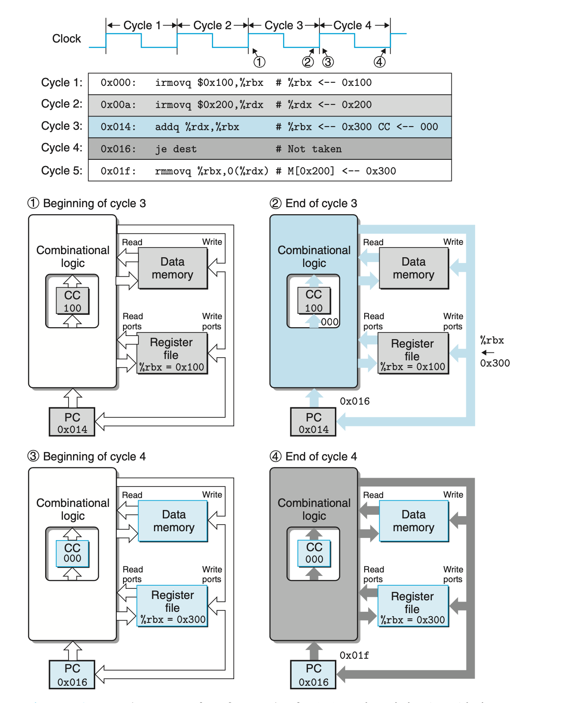

# 4.3.3 seq timing

Tracing two cycles of execution by SEQ. Each cycle begins with the state elements (program counter, condition code register, register file, and data memory) set according to the previous instruction. Signals propagate through the combinational logic, creating new values for the state elements. These values are loaded into the state elements to start the next cycle

原则： No reading back

一个例子， 实现 pushq 的时候，如果先对 %rsp 减8，随后采用更新后的 %rsp 作为写操作的地址。这样就会违反这个原则。 而我们的实现则是，生成一个signal valE作为stack pointer，将这个信号同事作为register写入的值和memory write的地址，这两个操作将在下一个上升沿同时触发。
