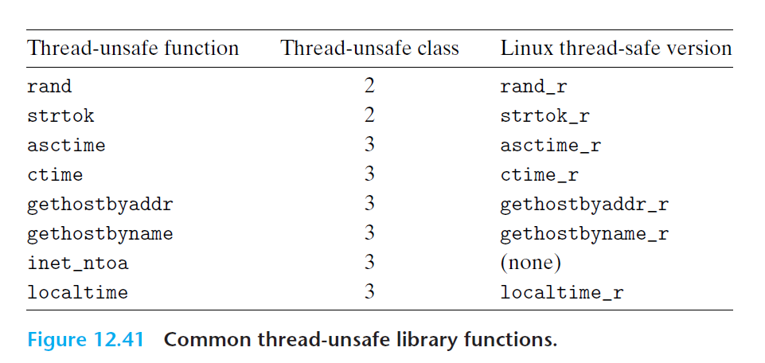

# Ch12 Concurrent Programming

## 12.7 Other Concurrency Issues

### 12.7.1 Thread Safety

四种线程不安全的行为：

1. 不保护共享变量的函数；
2. 保持跨越多个调用的状态的函数，例如 rand 函数；
3. 返回指向静态变量的指针的函数；
4. 调用线程不安全的函数。

### 12.7.2 Reentrancy

可重入函数：其被多个线程调用时，不会引用任何共享数据。

### 12.7.3 Using Existing Library Functions in Threaded Programs

