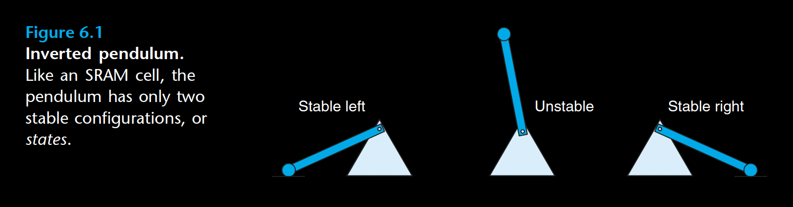

SRAM stores each bit in a bistable memory cell. Each cell is implemented with
a six-transistor circuit. This circuit has the property that it can stay indefinitely
in either of two different voltage configurations, or states. Any other state will
be unstable—starting from there, the circuit will quickly move toward one of the
stable states. Such a memory cell is analogous to the inverted pendulum illustrated bellow.

The pendulum is stable when it is tilted either all the way to the left or all the
way to the right. From any other position, the pendulum will fall to one side or the
other. In principle, the pendulum could also remain balanced in a vertical position
indefinitely, but this state is metastable—the smallest disturbance would make it
start to fall, and once it fell it would never return to the vertical position.

Due to its bistable nature, an SRAM memory cell will retain its value indefinitely,
as long as it is kept powered. Even when a disturbance, such as electrical
noise, perturbs the voltages, the circuit will return to the stable value when the
disturbance is removed.

