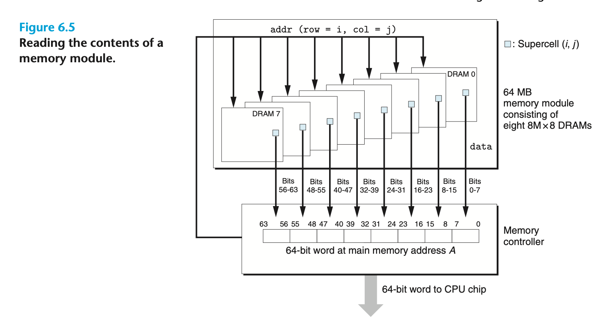

DRAM chips are packaged in *memory modules* that plug into expansion slots on the main system board (motherboard). Core i7 systems use the 240-pin *dual inline memory module (DIMM),* which transfers data to and from the memory controller in 64-bit chunks.

Figure 6.5 shows the basic idea of a memory module. The example module stores a total of 64 MB (megabytes) using eight 64-Mbit 8M × 8 DRAM chips, numbered 0 to 7. Each supercell stores 1 byte of *main memory*, and each 64-bit word at byte address A in main memory is represented by the eight supercells whose corresponding supercell address is (i,j). In the example in Figure 6.5, DRAM 0 stores the first (lower-order) byte, DRAM 1 stores the next byte, and so on.

To retrieve the word at memory address A, the memory controller converts A to a supercell address (i, j ) and sends it to the memory module, which then broadcasts i and j to each DRAM. In response, each DRAM outputs the 8-bit contents of its (i, j ) supercell. Circuitry in the module collects these outputs and forms them into a 64-bit word, which it returns to the memory controller.

