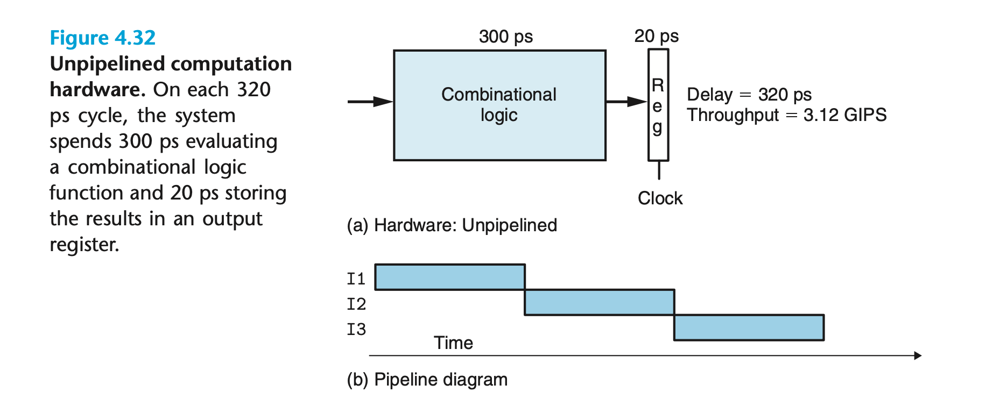
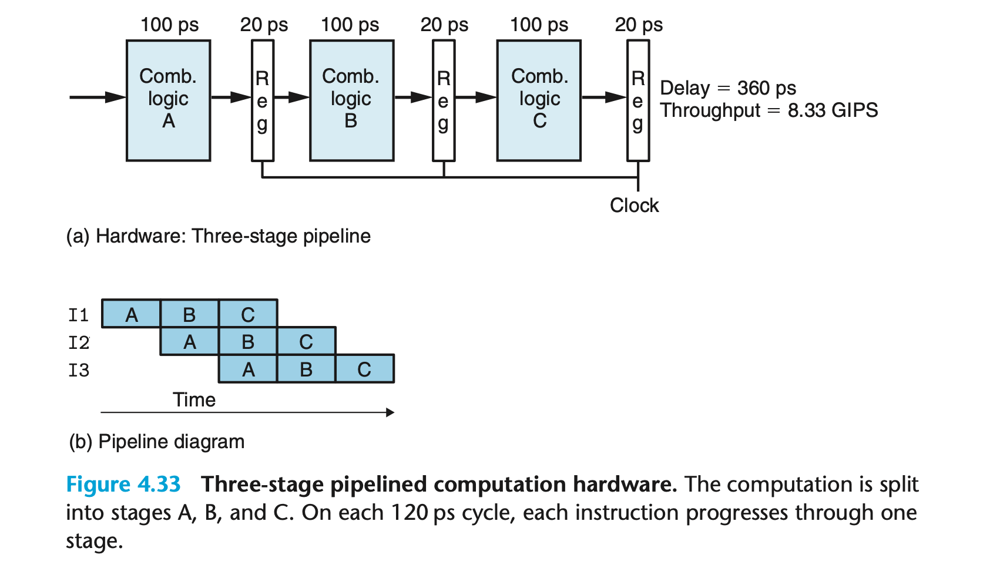

## 4.4 General Principles of Pipelining

我们来考虑一些 pipeline 系统的通用原则。 这和咖啡馆或者洗车房的流水线是类似的。

key feature 就是提高吞吐量；当然也可能造成延迟变大。

### 4.4.1 Computational Pipelines

一个 unpipelined 系统示例

吞吐量如下：

而 pipeline 的情况下 吞吐量大大提高，延时略有提升。
