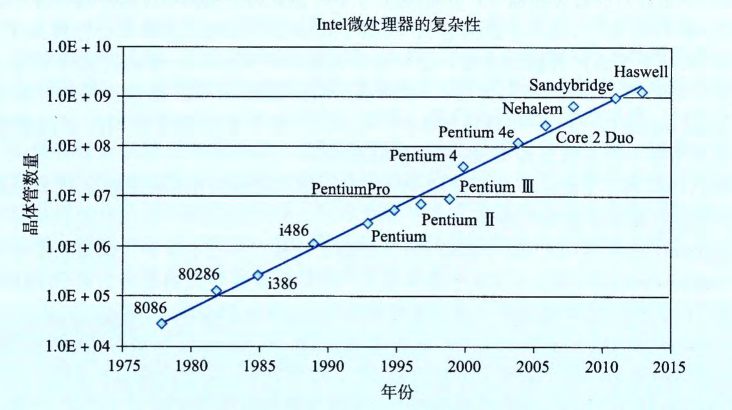

## 第3章 程序的机器级表示

计算机执行**机器代码**，用字节序列编码低级的操作，包括处理数据、管理内存、读写存储设备上的数据。

编译器：基于编程语言的规则、目标机器的指令集和操作系统遵循的惯例，经过一系列的阶段生成机器代码。

GCC C语言编译器：以汇编代码的形式产生输出。

汇编代码：机器代码的文本表示，给出程序中的每一条指令。然后GCC调用汇编器和链接器，根据汇编代码生成可执行的机器代码。

高级语言编程中，机器屏蔽了程序的细节——机器级的实现，提供的抽象级别比较高，工作效率会更高，也更可靠。

汇编代码编程中，程序员指定程序用来执行的计算的低级指令。高级语言工作效率更高，具有可移植性。

> 网络旁注：ASM：IA32 IA32编程
>
> IA32是x86-64的32位前身，是Intel在1985年提出。

32位机器：4GB的随机访问存储器。

64位机器：多达256TB、16EB的内存空间。

### 3.1 历史观点

Intel处理器俗称`x86`处理器。是一代单芯片、16位微处理器之一。

表示：K表示1000，M表示1000000，G表示1000000000。

**8086**：1978年，29K的晶体管。第一代单芯片、16位微处理器之一。最初的机器型号只有32768字节的内存和两个软驱。

从体系结构上看，这些机器只有655360字节的地址空间——地址只有20位长(可寻址范围是1048576字节)，而操作系统保留了393216字节自用。

1980年，提出了8087浮点协处理器(45K个晶体管)，它与一个8086或8088处理器一同运行，执行浮点指令。称为"x87"。

**80286**：1985年，134K个晶体管。增加了更多的寻址模式，构成了IBM PC-AT个人计算机的基础，是MS Windows最初的使用平台。

**i386**（1985年，275K个晶体管）。将体系结构扩展到32位。增加了**平坦寻址模式(flataddressing model)**，Linux和最近版本的Windows 操作系统都是使用的这种模式。这是Intel系列中第一台全面支持 Unix 操作系统的机器。

**i486**(1989 年，1.2M个晶体管)。改善了性能，同时将浮点单元集成到了处理器芯片上，但是指令集没有明显的改变。

**Pentium**(1993 年，3.1M个晶体管)。改善了性能，不过只对指令集进行了小的扩展。

**PentiumPro**（1995年，5.5M个晶体管）。引全新的处理器设计，在内部被称为P6微体系结构。指令集中增加了一类“**条件传(conditionalmove)**”指令。

**Pentium/MMX**（1997年，4.5M个晶体管）。在 Pentium 处理器中增加了一类新的处理整数向量的指令。每个数据大小可以是 1、2或4字节。每个向量总长 64 位。

**Pentium II**（1997年，7M个晶体管）。P6微体系结构的延伸。

**Pentium III**（1999 年，8.2M个晶体管）。引人了SSE，这是一类处理整数或浮点数向量的指令。每个数据可以是1、2或4 个字节，打包成 128 位的向量。由于芯片上包括了二级高速缓存，这种芯片后来的版本最多使用了`24M`个晶体管。

**Pentium 4**（2000年，42M个晶体管）。SSE 扩展到了`SSE2`，增加了新的数据类型（包括双精度浮点数），以及针对这些格式的 144 条新指令。有了这些扩展，编译器可以使用SSE指令(而不是`x87`指令)，来编译浮点代码。

**Pentium 4E**（2004 年，125M个晶体管）。增加了超线程(hyperthreading)，这种技术可以在一个处理器上同时运行两个程序；还增加了EM64T，它是Intel对AMD提出的对IA32的64位扩展的实现，我们称之为x86-64。

**Core 2**（2006 年，291M个晶体管）。回归到类似于P6的微体系结构。Intel的第一个多核微处理器，即多处理器实现在一个芯片上。但不支持超线程。

**Core i7**，Nehalem(2008 年，781M个晶体管)。既支持超线程，也有多核，最初的版本支持每个核上执行两个程序，每个芯片上最多四个核。

**Core i7**，Sandy Bridge(2011年，1.17G个晶体管)。引入了AVX，这是对 SSE 的扩展，支持把数据封装进256 位的向量。

**Core i7**，Haswell(2013 年，1.4G 个晶体管)。将AVX 扩展至AVX2，增加了更多的指令和指令格式。

每个后继处理器的设计都是后向兼容的——较早版本上编译的代码可以在较新的处理器上运行。Intel处理器系列有好几个名字，包括 `IA32`，也就是“Intel 32 位体系结构(Intel Architecture 32-bit)”，以及最新的`Intel 64`，即IA32的64 位扩展，我们也称为`x86-64`。最常用的名字是“`x86`”，我们用它指代整个系列，也反映了直到486处理器命名的惯例。

> **摩尔定律(Moore's Law)**
>
> 含义：晶体管数量每26个月就会翻一番。
>
> 
>
> 1965年，Gordon Moore，Intel公司的创始人，根据当时的芯片技术(那时他们能够在一个芯片上制造有大约 64 个晶体管的电路)做出推断，预测在未来 10 年，芯片上的晶体管数量每年都会翻一番。这个预测就称为摩尔定律。正如事实证明的那样，他的预测有点乐观，而且短视。在超过 50 年中，半导体工业一直能够使得晶体管数目每 18 个月翻一倍。
>
> 对计算机技术的其他方面，也有类似的呈指数增长的情况出现，比如磁盘和半导体存储器的存储容量。这些惊人的增长速度一直是计算机革命的主要驱动力。

### 3.2 程序编码

假设有一个C程序，有两个文件`p1.c`和`p2.c`。

Unix命令行编译：`linux > gcc -0g -o p p1.c p2.c`。

命令：`gcc`指的是`GCC C`编译器，是Linux默认的编译器。

`-Og`：编译器使用会生成符合原始C代码整体结构的机器代码的优化等级。使用较高级别优化产生的代码会严重变形，以至于产生的机器代码和初始源代码之间的关系难以理解。

`gcc`命令调用了一整套程序，将源代码转化成可执行代码。

1. **C预处理器**：扩展源代码，插入所有用`#include`命令指定的文件，扩展所有用`#define`声明指定的宏。
2. 编译器产生两个源文件的汇编代码，名字分别为`p1.s`和`p2.s`。
3. 汇编器会将汇编代码转化成二进制目标代码文件`p1.o`和`p2.o`
4. 目标代码是机器代码的一种形式，它包含所有指令的二进制表示。
5. 链接器将两个代码文件与实现库函数的代码合并，并产生最终可执行代码文件`p`。