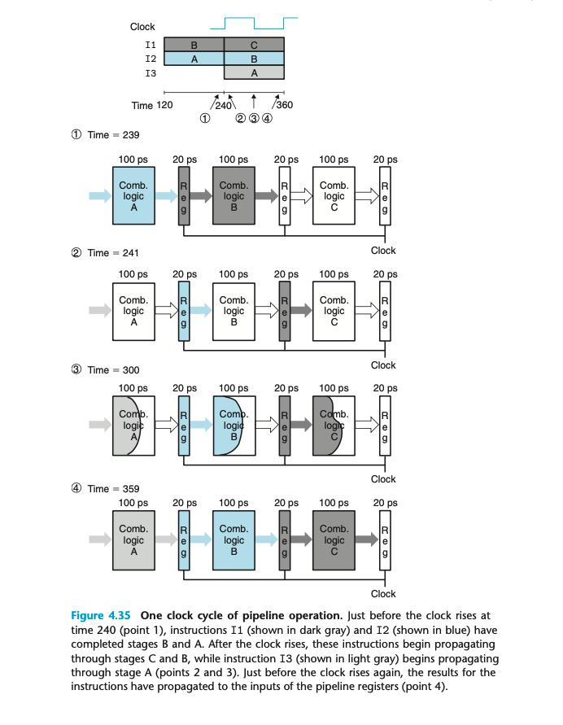

### 4.4.2 A Detailed Look at Pipeline Operation

指令转换受控于时钟信号。下图是一个详细的例子。每120ps一个时钟周期。

每个时钟上升沿到来之前，所有的组合电路计算已经完成，并即将把状态写到 register 中。等待上升沿触发，写入状态到下一个寄存器，并开始传播。每个组合逻辑从寄存器或者外界得到下一条指令的数据，开始新一轮计算。

不同的 section 传播速率不同；时钟周期需要受限于最慢的传播速度。