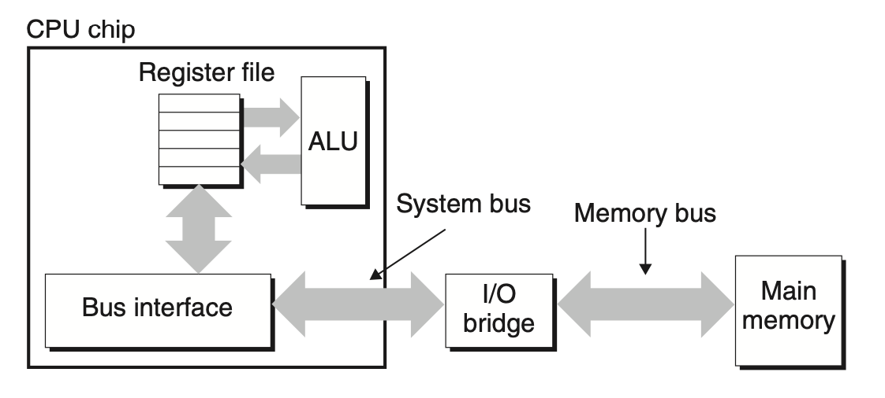

Data flows back and forth between the processor and the DRAM main memory over shared electrical conduits called *buses*. Each transfer of data between the CPU and memory is accomplished with a series of steps called a *bus transaction*. A *read transaction* transfers data from the main memory to the CPU. A *write transaction* transfers data from the CPU to the main memory.

A *bus* is a collection of parallel wires that carry address, data, and control signals. Depending on the particular bus design, data and address signals can share the same set of wires or can use different sets. Also, more than two devices can share the same bus. The control wires carry signals that synchronize the transaction and identify what kind of transaction is currently being performed.

The following figure shows the configuration of an example computer system. The main components are the CPU chip, a chipset that we will call an *I/O bridge* (which includes the memory controller), and the DRAM memory modules that make up main memory. These components are connected by a pair of buses: a *system bus* that connects the CPU to the I/O bridge, and a *memory bus* that connects the I/O bridge to the main memory. The I/O bridge translates the electrical signals of the system bus into the electrical signals of the memory bus. As we will see, the I/O bridge also connects the system bus and memory bus to an *I/O bus* that is shared by I/O devices such as disks and graphics cards.

