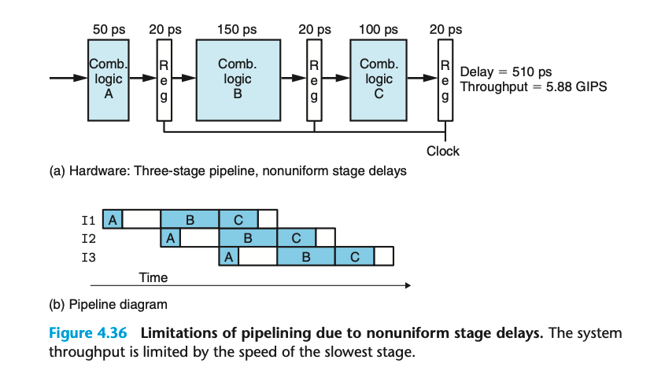
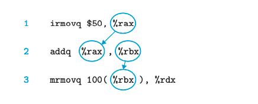
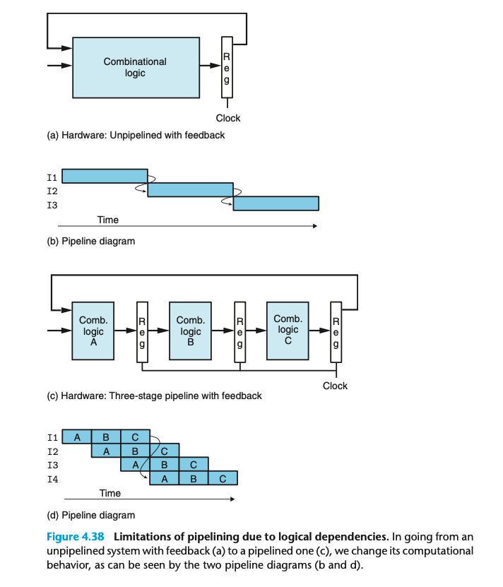

### 4.4.3 Limitations of Pipelining

之前讨论的是理想情况下的流水线，每个独立的阶段都花费1/3的时间。现实中则会有诸多限制。

**Nonuniform Partitioning**

现实的情况分布是不均匀的，例子中A可能idle 100ps，C可能idle 50ps。
而一些硬件单元比如ALU和memories不能被分割到多个不同的单元；这就导致均匀的阶段划分比较困难。

在不同的地方插入 pipeline register 会影响最终的吞吐量。

### 4.4.4 Pipelining a System with Feedback

在执行程序的系统中，指令之间其实是有潜在关联的。

> The irmovq instruction (line 1) stores its result in %rax, which then must be read by the addq instruction (line 2); and this instruction stores its result in %rbx, which must then be read by the mrmovq instruction (line 3).

例子中 T1 的输出不再是 T2 的输入，而变成了 T4 的输入。
我们需要处理这种情况。