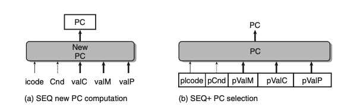
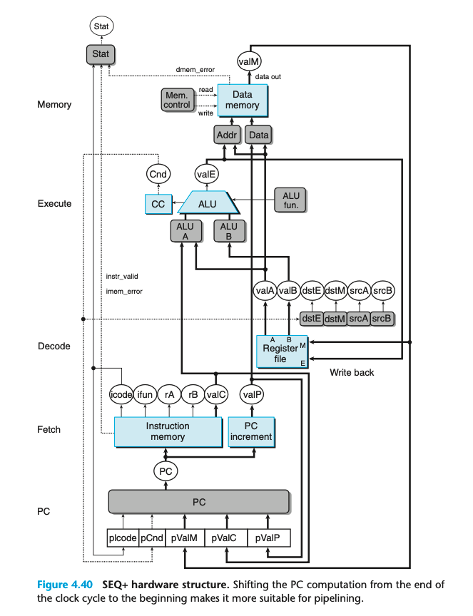
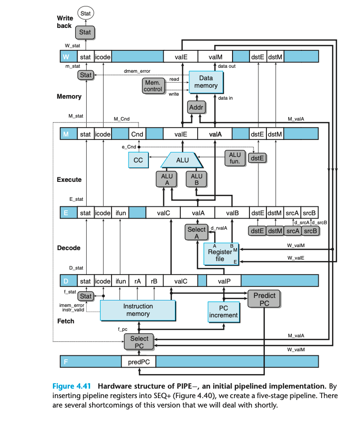
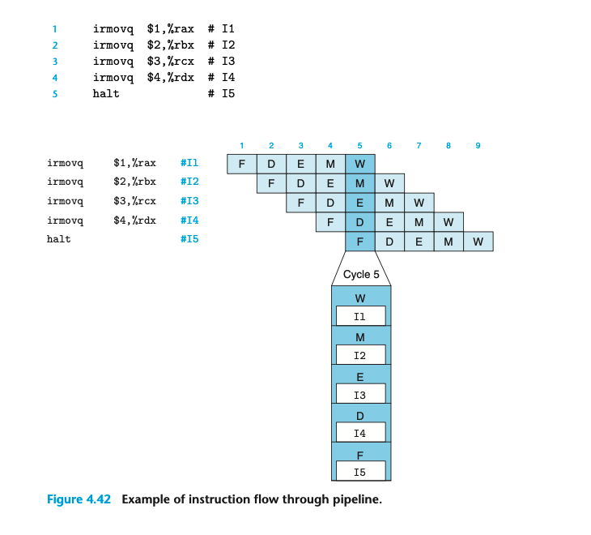

## 4.5 Pipelined Y86-64 Implementations

现在我们开始设计整个处理器。

### 4.5.1 SEQ+: Rearranging the Computation Stages

为了转向流水线，我们首先调整SEQ的stage顺序，是的第一个阶段是update PC。

相比于 SEQ 我们用了额外的寄存器存储状态；这样其余逻辑可以和原来保持一致。

这样的改动是 circuit retiming 的一个例子。

### 4.5.2 Inserting Pipeline Registers

不同阶段之间的蓝白框代表用于pipeline的寄存器。
蓝色代表不同的寄存器，每个寄存器存储一些field，用白色框标出。

这是一个流水线运行起来的例子。