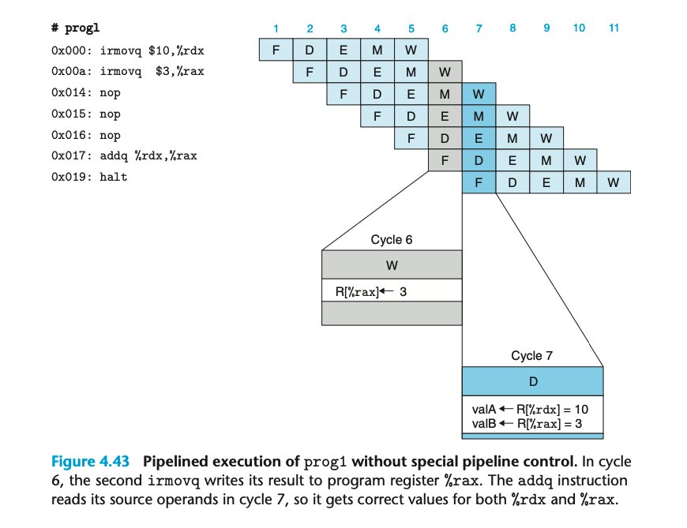
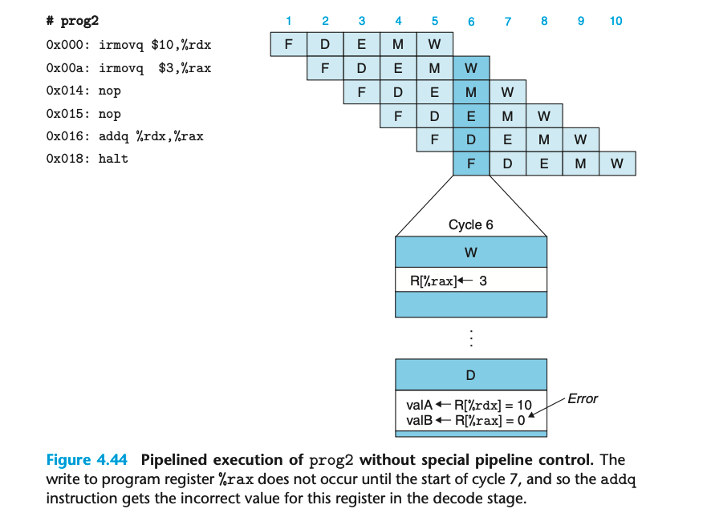
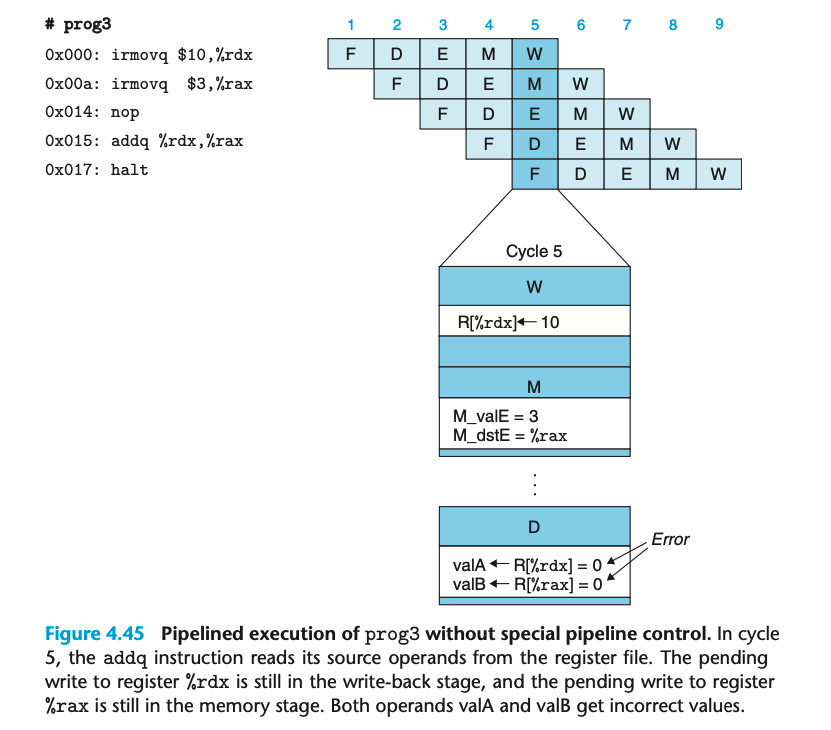
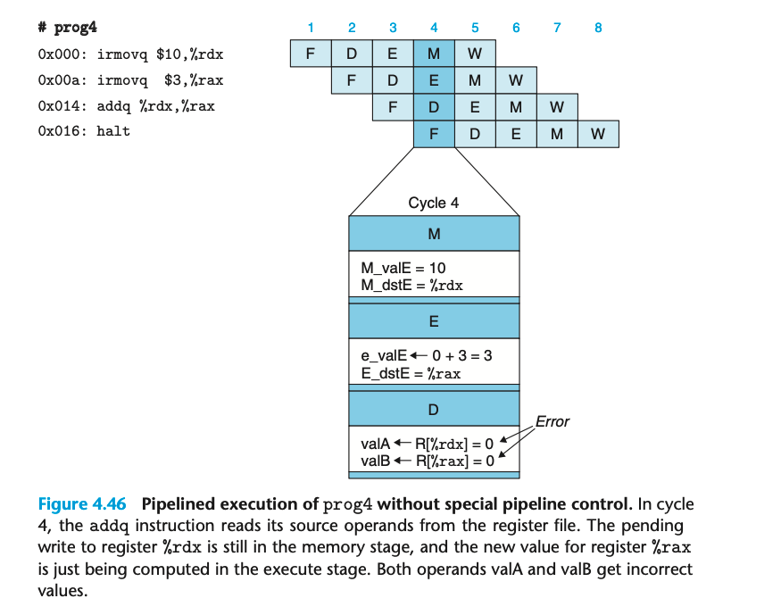
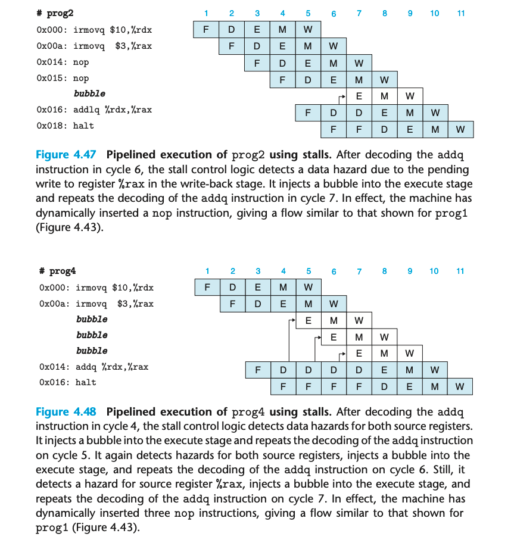
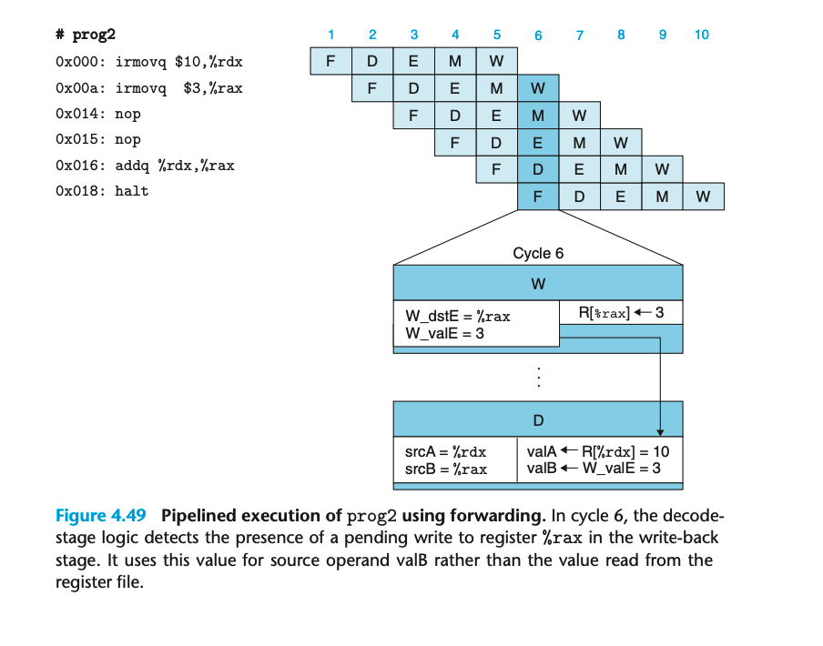
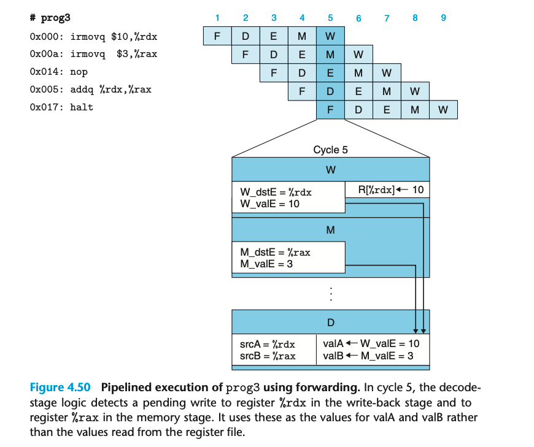
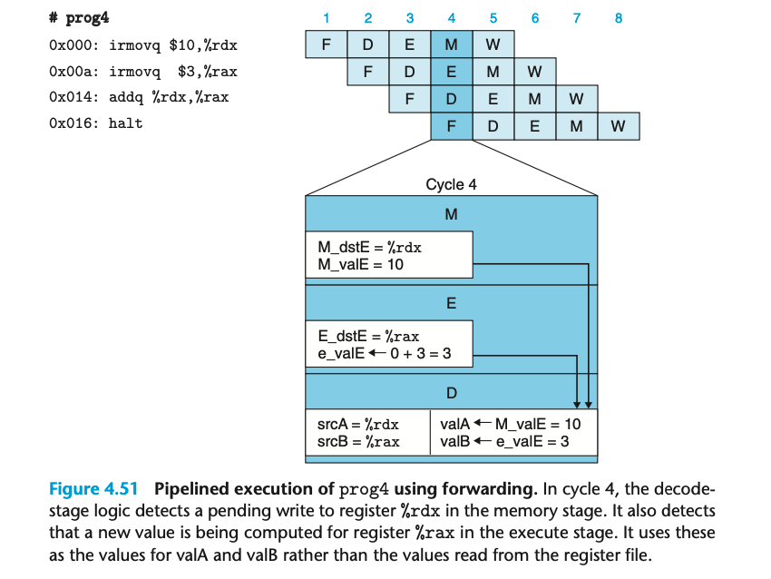

### 4.5.5 Pipeline Hazards
pipeline 导致的问题之一是 如果连续的指令之间有依赖关系会出现问题

1. 数据依赖 后面的指令需要用到前面指令算出来的结果
2. 控制以来 前面的指令决定后续指令的地址 比如 jump call 和 return 指令

这样的依赖出现时，我们就需要进行冒险，数据冒险和控制冒险。

在周期7之前，两个 irmovq 指令已经完成 write-back 所以没有问题；但我们引入了是三个 nop

这次则是一个有问题的程序，少了一次 nop

再减少一次 nop 则 add 指令的两个输入都是有问题的

这是全部 nop 都被移除的情况

Avoiding Data Hazards by Stalling

stall 本质就是让某个指令再某个阶段多等一段时间？ 只要检测到 hazards 就插入 bubble 重复当前阶段
此后的指令也需要呗 hold back。 保留 program counter 在某个固定值即可。

Avoiding Data Hazards by Forwarding

forwarding 是另一种方案，直接讲 pending write 的值传递给需要从 register file 读该值的地方。

硬件需要增加额外的 data connections 和 control logic

最终的解决方案；完全避免了 stall。

