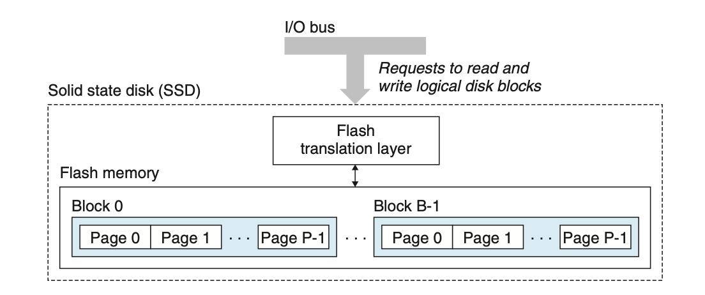

A solid state disk (SSD) is a storage technology, based on flash memory, that in some situations is an attractive alternative to the conventional rotating disk. The following figure shows the basic idea. An SSD package plugs into a stan- dard disk slot on the I/O bus (typically USB or SATA) and behaves like any other disk, processing requests from the CPU to read and write logical disk blocks. An SSD package consists of one or more flash memory chips, which replace the me- chanical drive in a conventional rotating disk, and a *flash translation layer*, which is a hardware/firmware device that plays the same role as a disk controller, trans- lating requests for logical blocks into accesses of the underlying physical device.

​																		(固态硬盘原理)