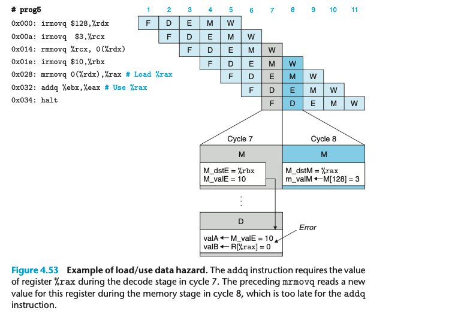
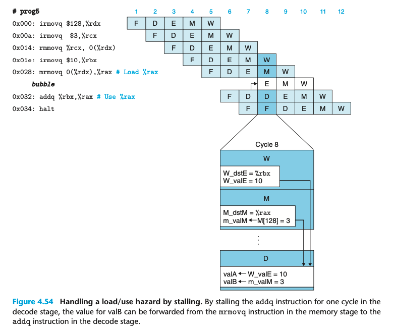

### 4.5.5 Pipeline Hazards

Load/Use Data Hazards
有一类问题可以通过 forwarding 解决，因为后续有相关的 memory 读。

这里是另一类问题， load/use hazard。 这里 cycle8 才会 generate 相关的值，但是 cycle7 就需要用到。
我们的解决方案是组合 stalling 和 forwarding。 

