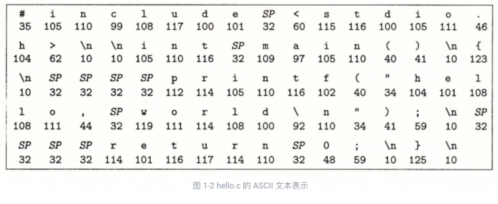

# 1.1 信息就是位 + 上下文

**计算机系统**是由**硬件和系统软件**组成的，它们共同工作来运行应用程序。

```c
#include <stdio.h>
int main()
{
    printf("hello, world\\n");
    return 0;
}
```

我们通过跟踪 **hello 程序**的生命周期来开始对系统的学习——从它被程序员**创建开始，到在系统上运行，输出简单的消息，然后终止。**

8位一个字节

大部分的现代计算机系统使用ASCII 标准来表示文本字符：

实际上就是用一个唯一的**单字节大小的✦整数值✦**来表示每个字符



hello.c 这样只由 ASCII 字符构成的文件称为**文本文件**，所有其他文件都称为**二进制文件**

hello.c 的表示方法说明了一个基本思想∶系统中所有的信息——包括磁盘文件、内存中的程序、内存中存放的用户数据以及网络上传送的数据，都是由一串比特表示的。