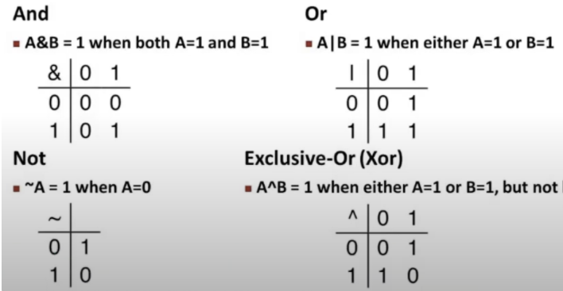
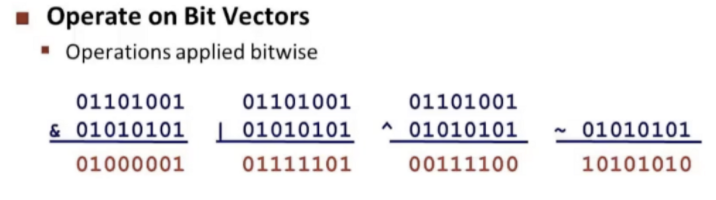
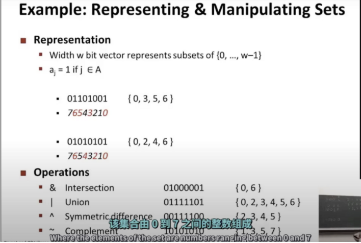
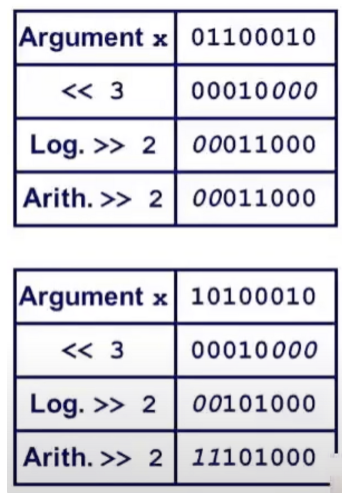
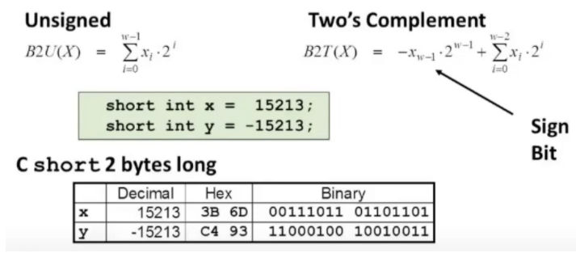
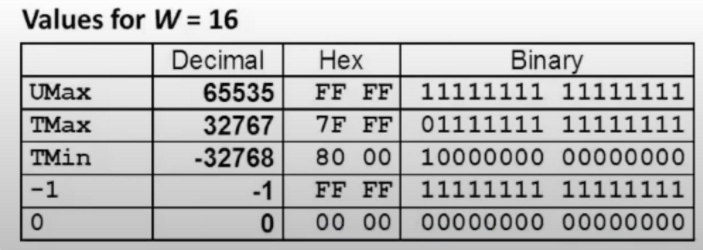
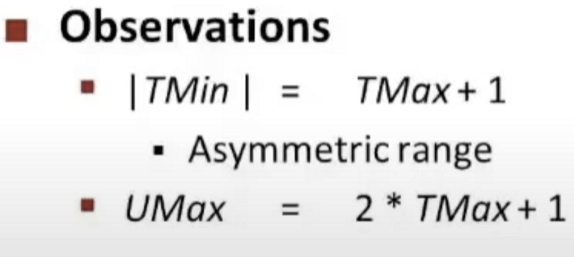

# Bits,Bytes,and Integers

## 进制

二进制是利用高低电平去代表的

1字节是8位

Hex：16进制   4bits

Decimal：10进制

Binary：8进制

虚拟地址空间是由机器字长决定的

## 逻辑运算

用0和1来表示逻辑运算，其中0代表false，1代表true，并提出了以下运算规则

1. &运算
2. | 运算
3. ^ 异或
4. ～ 取反

基于上述规则进一步延伸出下面的运算规则：

## 二进制的逻辑运算的一个应用

表示集合

Width w bit vector represents subsets of {0,…,w-1}

## C语言实现的逻辑操作符号

定义符号：&& 、||、！

基于上述符号的运算，定义规则：

- 0是false
- 任何非0是true
- 总是return 0 或 1
- 会提前终止运算

一些例子：

- !Ox41 → 0x00

- !0x00 → 0x01

- !!0x41 → 0x01

- 0x69 && 0x55 → 0x01

- 0x69 || 0x55 → 0x01

- p && *p   ⇒ 如果是空的指针，则这种运算方式则会提前终止后面的取值运算（提前终止）

  

## C语言的位运算符

（Shift Operations）

左移：X << Y

右移：X >> Y

注意：

最后一个Arith ⇒ arithmetic 补位根据当前的正负

## 整数的二进制表示

分为2种情况去表示：

1.无符号整数（unsigned）

2.带有符号的整数(Two’s Complement)

上述2种情况分别使用下面公式去加密：

如公式所示：

15213 = 0b0011101101101101 转换成10进制

-15213 = -0b1000000000000000 + 0b100010010010011  = -32768 + 16384

事实上，如果使用“补码”这种方式，如果是正数，如果最高位不使用，则和unsigned是一样的（补码这种方式的最大值会少最高位）

无符号和补码的数字范围

观察推导出的关系：

