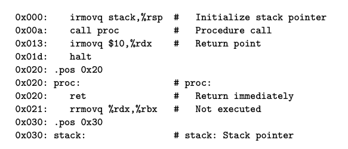
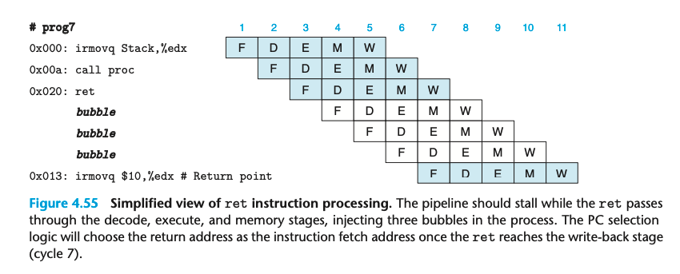
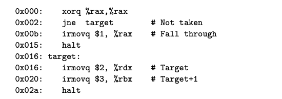
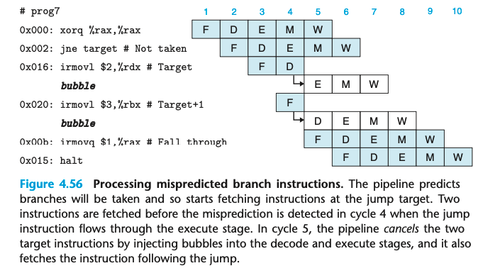

### 4.5.5 Pipeline Hazards

Avoiding Control Hazards

control hazards 出现在 ret 和 jump 指令中

我们先来看一个 ret 的例子

这是一个简化视角的 ret 指令的处理过程，采用了 stall 机制。 直到 ret 完成了 memory stage，才能进行下一步。

处理 mispredicted 分之，我们考虑这个例子。

一开始流水线先直接执行了 not taken 的路径，直到第4个周期，发现了分支预测的错误，通过插入 bubble 撤销了之前的执行，继续执行 fall through 的指令。这时还没有指令来得及修改 visible 的 state，撤销变得非常容易。 仅仅额外浪费了两个周期的指令处理。

在4.5.8，我们会讨论一个简单的扩展，使得 stall 和 bubble 变成流水线控制逻辑的一部分。

