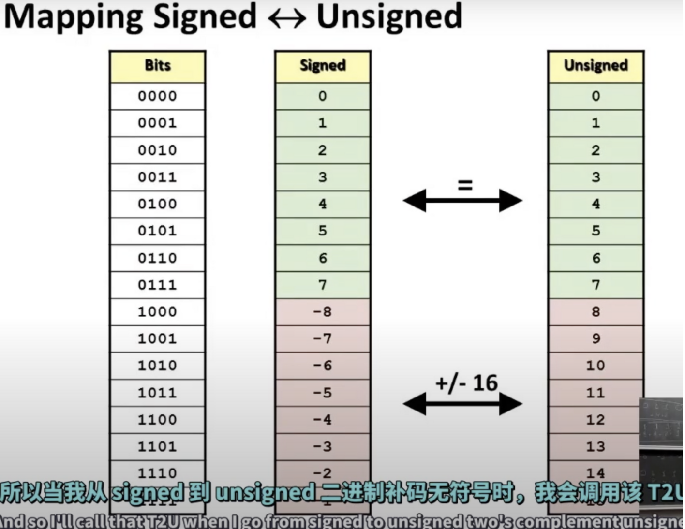
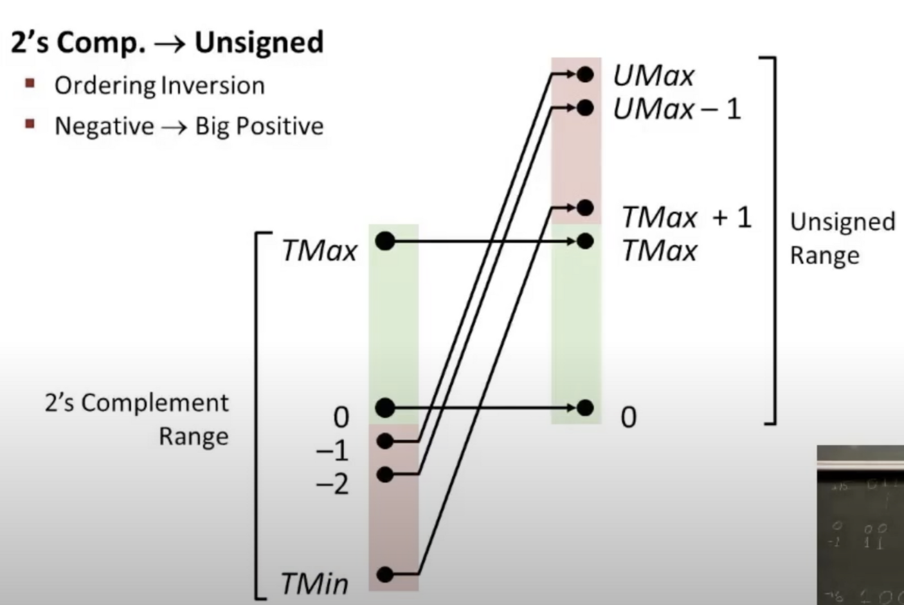
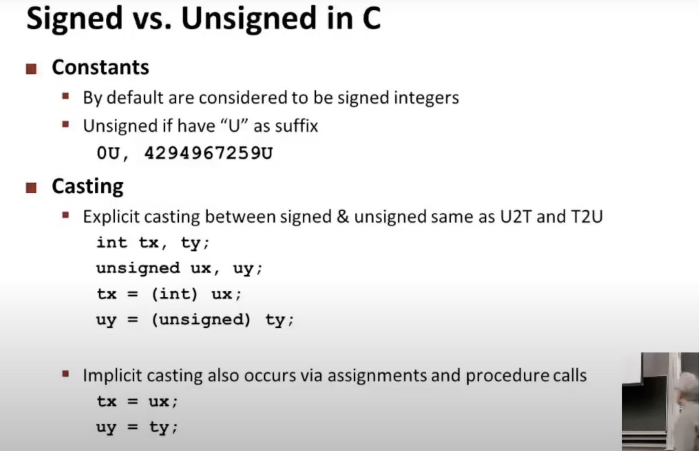
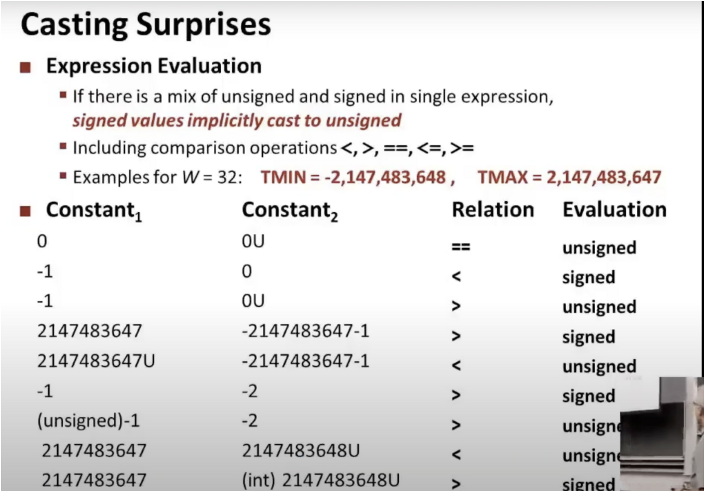

# C语言中的Signed和Unsigned

## 相互转换

通过二进制表示作为桥梁，然后按照他们各自的规则（公式）转换为十进制的数

范围和特征对应关系，心里面要有对应的例子

11111111 在 二进制补码中 是 -1  在无符号中是最大值

100000 在 二进制补码中 是 最小值 在无符号中是 01111111 + 1 即 二进制补码的最大值 + 1

pthon和Java不用考虑上面的转换，但是C要考虑，因为C语言可以声明无符号number

## 【显式】和【隐式转换】

C语言中【二进制补码】和【无符号】方式的【显式】和【隐式转换】

## 其他规则和例子

下面是一些转换的规则和例子

在单独的表达式中，【有符号】的会隐式转换成【无符号】的，例如比较的运算符中

下面的比较都是转换成二进阶码之后的比较，按照上面规则可以得出他们的relation

