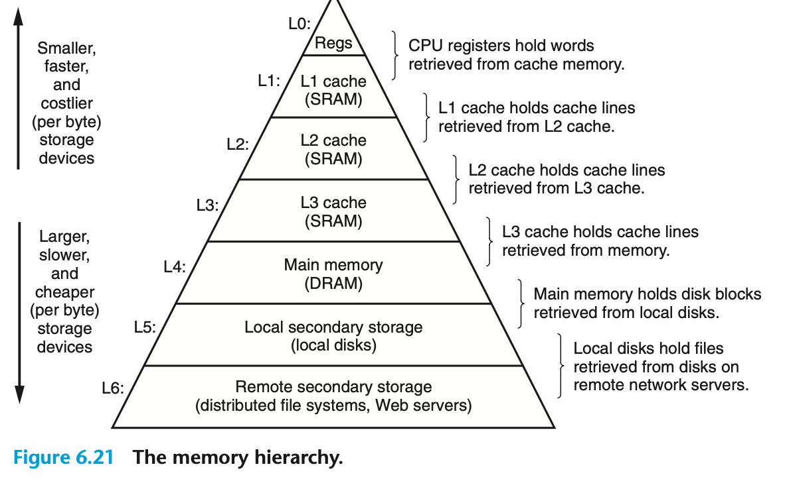

# 内存层次
* Storage technology. Different storage technologies have widely different access times. Faster technologies cost more per byte than slower ones and have less capacity. The gap between CPU and main memory speed is widening.
* Computer software. Well-written programs tend to exhibit good locality.

