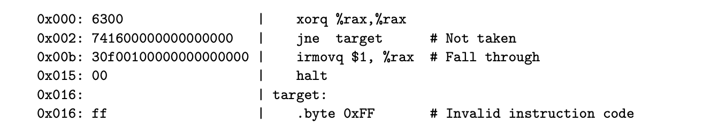
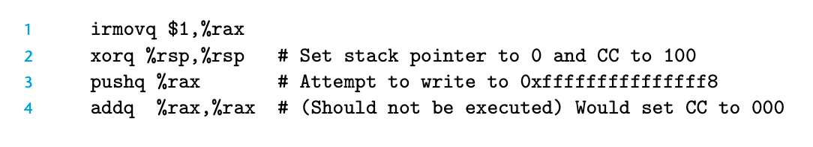

### 4.5.6 Exception Handling

我们的处理器可以处理三种内部异常：
1. halt指令
2. 错误的指令和function code的组合
3. 访问非法地址 （fetch\data read\data write）

更完善的处理器应该可以处理外部异常，比如从网卡读到一个信号或者用户点击鼠标等

异常处理是很有挑战性的；他们还需要破坏流水线的过程。

在流水线中，异常处理需要考虑多个微妙的地方。 

首先，我们是可能遇到多个指令的异常同时发生的。比如，halt发生在fetch阶段，同时，data memory上报了越界。 我们需要决定上报其中哪个异常，一般来说，我们会上报执行更早的指令。

其次，还有一种情况是我们fetch并执行了某个指令，出现了异常，但是不久就被取消了因为分支预测错了。

在这个例子中，预测分支，我们选择了target分支，然后在decode阶段，会发现这是一个非法的指令。但是很快流水线会发现这个分支不应该被fetch；所以我们要cancel这个指令，并且阻止异常发生。

第三点，pipeline的处理器会在不同的阶段更新不同的系统状态。所以有可能某个异常指令之后的指令在异常完成之前修改了部分state。

pushq 会产生异常，因为0xfffffffffffffff8越界，在memory stage会发生。此时addq在执行阶段，会修改rax的值，这就违背了“不能再异常指令之后修改用户可见状态”的原则。

为了解决问题，我们增加了一个stat变量在每个 pipeline register，如果出现异常，则会被设置，从而在流水线间传递，如果发现出现了异常，会停止执行当前的指令。

对于前述的三个细节。
由于流水线执行是按照指令顺序的，所以第一个到达 write-back 阶段的异常指令是最早出现异常的指令。
如果指令出现异常此后被cancel，则stat也会一起被cancel，没有影响。
由于stat的引入，异常指令后续指令也没有机会再修改 programmer-visible state。
