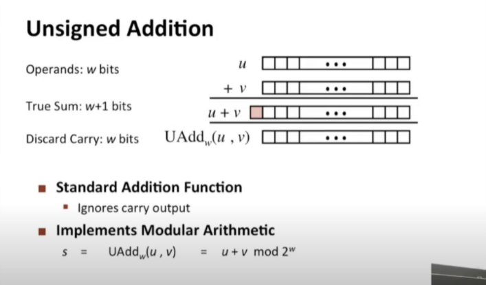
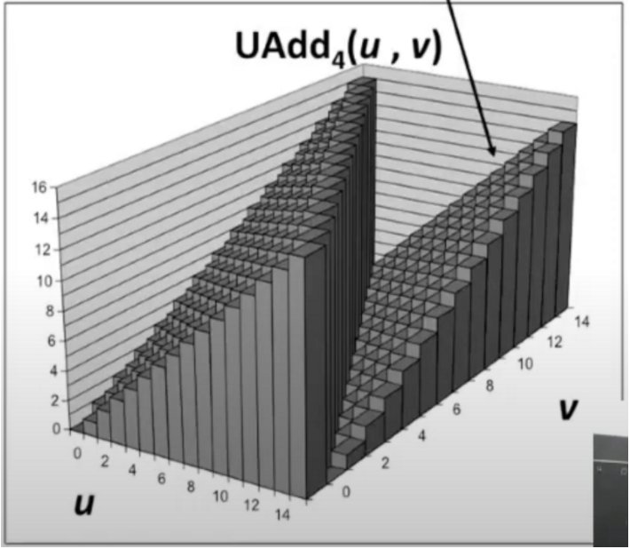
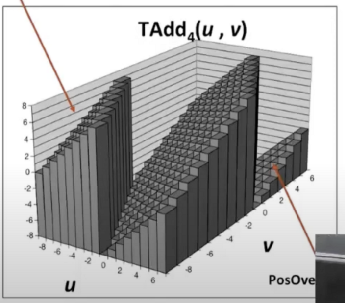
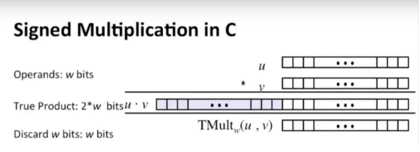
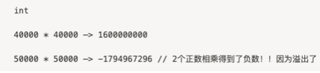
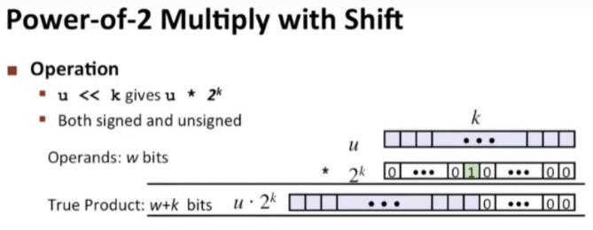

# 数的加法和乘法

数的运算和其他特性

### 加法

无符号数相加如果进位，需要舍弃（参考上面去掉最高位的情况）

下面是模拟最多4位的情况

1101(13) + 1010(10) = 0111(7) 进位超出舍去（去掉的位的大小的模）

有符号数相加如果进位，需要舍弃（参考上面去掉最高位的情况）

下面是模拟最多4位，最高位是符号位的情况

1101(-3) + 1010(-6) = 0111(7) 两个负数相加进位舍去，变成了正数

0111(7) + 0101(5) = 1100(-4) 两个正数，进位不舍去，相加得到负数

### 乘法

2个w位的数相乘 你可能需要一个2w位的数来保存结果 比如15(4位)*15(4位) = 225(8位)

最多只能w位表示，超过则舍去

2个例子(最高位是4去模拟)：

5*4=20 ⇒ 00010100 → 4

5*5=25 ⇒ 00011001 → -7

这也是第一节课正数相乘得到负数的原因

一个另外的例子：

1101(-3)  (13)

1110(-2). (14)

xxxx0110 6  182-0xb6

-3*-2=6

13*14=182转成16进制是b6

可以看到，在低位（合法的位），无符号和2进制补码（有符号）得到的结果是相同的（都是6）

如果是乘以2的幂，其实计算机会优先做移位操作 x*2 ⇒ x<<1 : 乘以2等于左移1位

因为做一次位移需要一个时钟周期(clock cycles)，做一次乘法操作需要11，12，13个时钟周期，现代最新的计算机的话我们需要3个时钟周期（还是比一个多）

