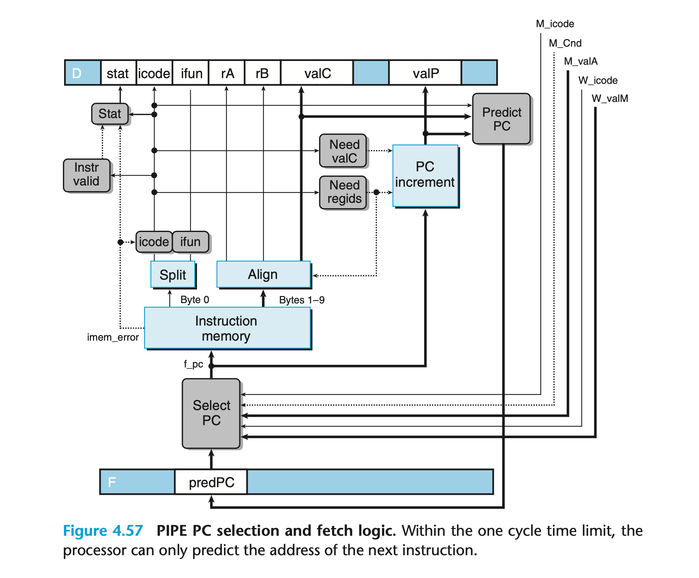
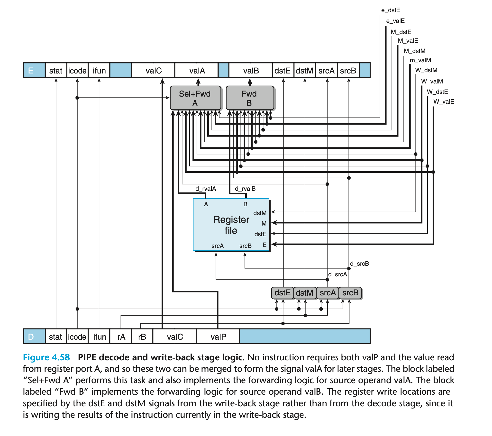
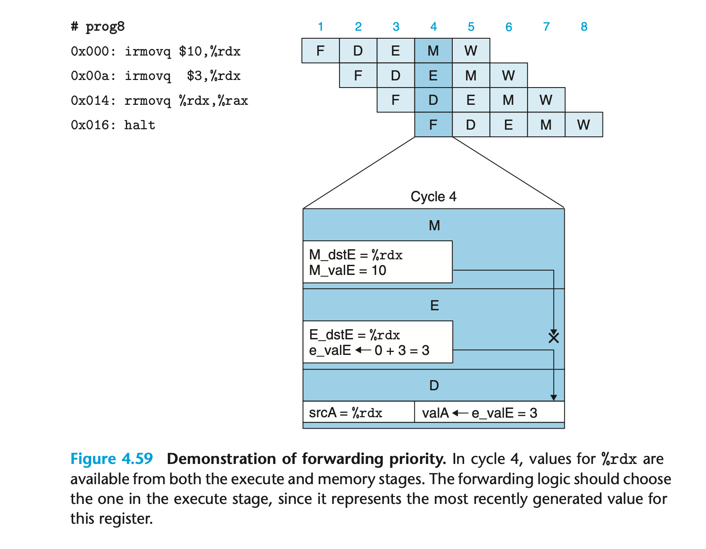

### 4.5.7 PIPE Stage Implementations
我们实现了带有 forwarding 的 PIPELINE 处理器；使用了大部分类似 SEQ 处理器的逻辑单元，增加了 pipeline register，也需要一些额外的控制单元。
本章介绍具体的设计细节。

区别仅仅在于前缀D_表示信号来自register D，d_表示结果产生于decode阶段。

PC Selection and Fetch Stage

PC selection 和 fetch 逻辑。

Decode and Write-Back Stages

forward的优先级很重要，影响正确性。

Execute Stage

Memory Stage

