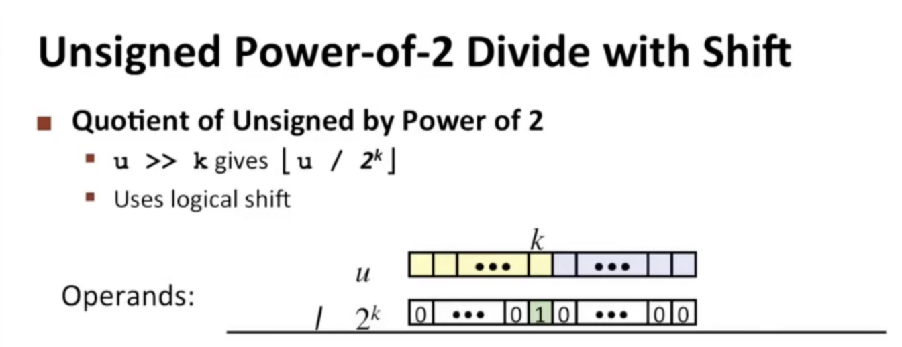

### 除以2的幂

右移

0110(6) >> 1 ⇒ 0011(3) >> 1 ⇒ 0001(1)  整数除法向下取整

1010(-6) >> 1 ⇒ 1101(-3) >> 1 ⇒ 1110(-2) >> 1 ⇒ 1111(-1)

-3/2的时候，也是向下（更小的数）取整，所以结果是-2

对于无符号数的右移是【逻辑移位】

对于有符号数的右移是【算数移位】

一个知识：

计算机在做比如除以16的操作的时候，会补位，然后再将其右移，而不是调用除法。因为在现代计算机中，除法依然很慢，计算机需要30个计算周期

### 取反

各个bit相反，然后+1

0110(6) ⇒ 1001 + 0001 ⇒ 1010(-6)