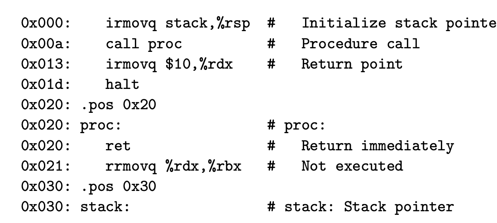
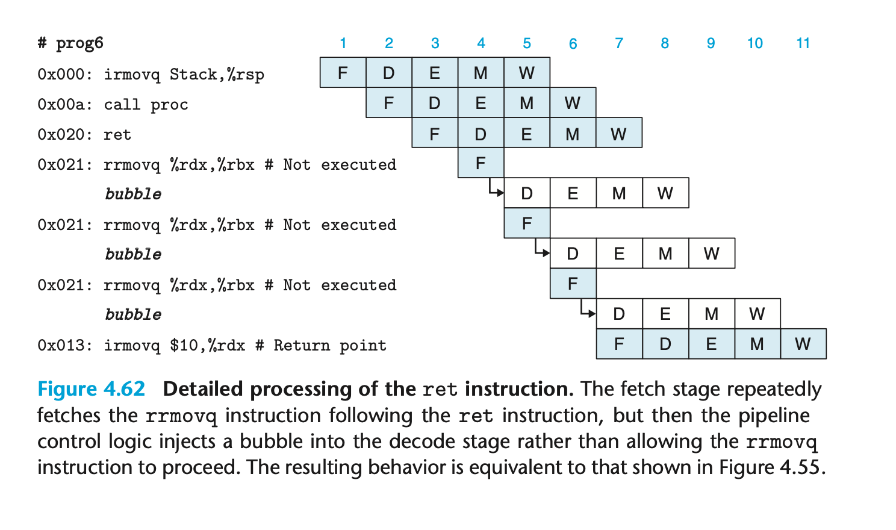
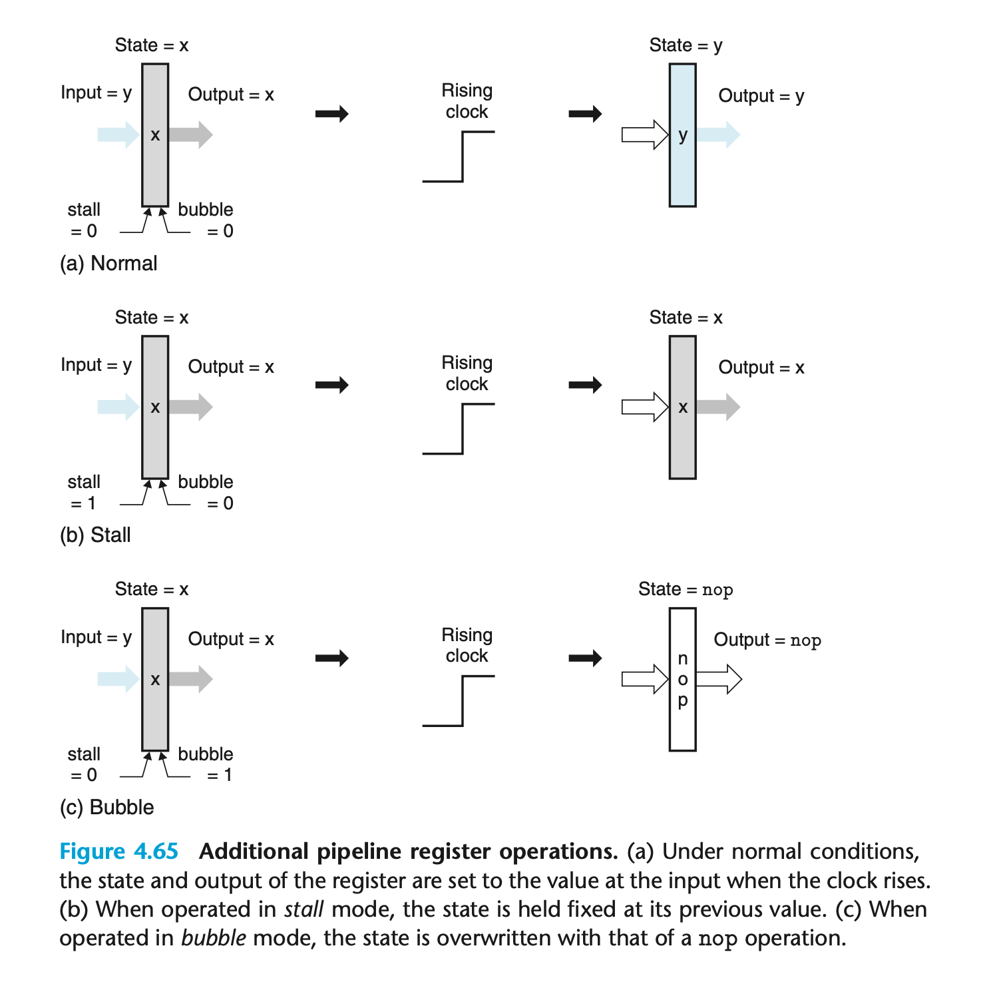
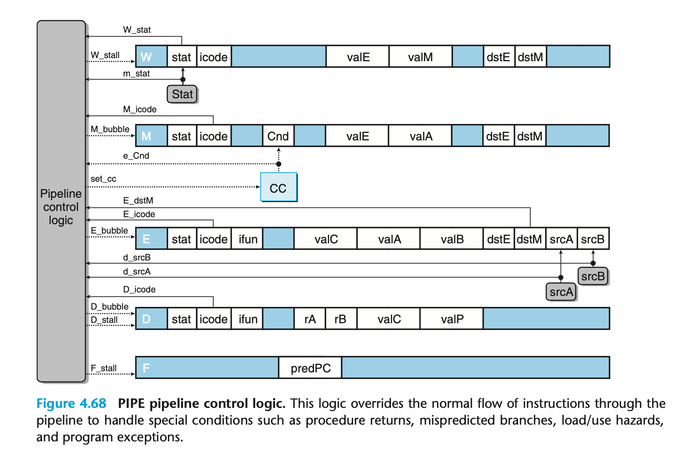

### 4.5.8 pipeline control logic

Load/use hazards 需要在 read from memory 和使用这个值之间插入 stall
Processing ret 需要 stall 直到 ret 达到写回阶段
Mispredicted branches 需要cacel一部分指令；并fetch错误jmp之后的指令
Exceptions 需要阻止异常之后的指令改变状态

processing ret

processing exception

bubble 和 stall 区别

control logic implementation
