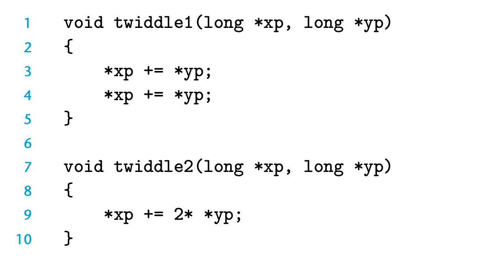

## 5.1 Capabilities and Limitations of Optimizing Compilers

现代编译器才用了非常复杂的算法；可以简化表达式，减少计算的时间。
gcc -o 参数代表优化级别

本书中主要考虑 O1级别的优化
优化器只会采用安全的优化，所以用户可能也需要花费一定的精力去写出编译器可以优化的代码。



看起来两者是等价的，但在 *xp = *yp 的时候，则会有问题；所以不能进行这样的优化

```c
x = 1000; y = 3000;
*q = y; /* 3000 */
*p = x; /* 1000 */ 
t1=*q; /*1000or3000*/
```

Memory Aliasing 则是一个优化的 blocker。
