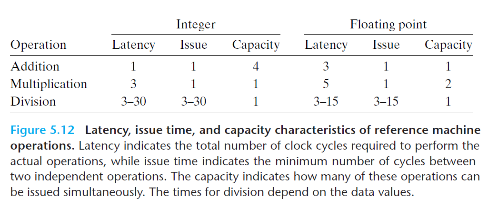

# Ch5 Optimizing Program Performance

## 5.7 Understanding Modern Processors

**5.7.2 Functional Unit Performance**

某个特定的算数运算的性能由以下条件决定：

1. 延迟（latency）：完成运算需要的总时间；
2. 发射时间（issue time）：两个连续的同类型的运算之间需要的最小时钟周期数；
3. 容量（capacity），表示能够执行该运算的功能单元的数量。

Intel Core i7 HasWell 的算数运算性能如下图，可以看出：从整数到浮点数、从加法到乘法再到除法，延时是不断增加的。

