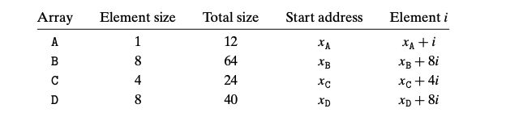
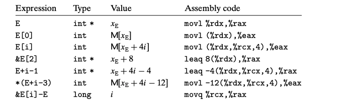

# 3.8 Array Allocation ans Access
数组在C语言中的操作主要通过指针加算术运算进行

## 3.8.1 Basic Principles
data type T 
T A[N] 初始地址为$x_A$
做了两个操作：
1. 申请了连续的 L*N 个bytes L为T类型所需要的空间
2. A赋值为 x_A

读取E[i] 等价于执行 `movl (%rdx,%rcx,4),%eax`

## 3.8.2 Pointer Arithmetic
&Expr 取地址 是一个指针
*Expr 取值 
