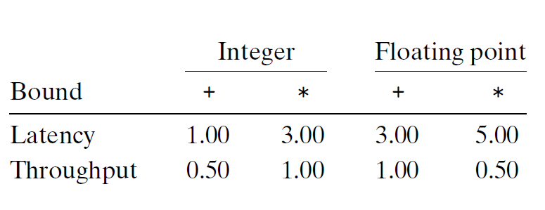

# Ch5 Optimizing Program Performance

## 5.7 Understanding Modern Processors

**5.7.2 Functional Unit Performance**

加法运算和乘法运算的发射时间都为1，指的是，每个时钟周期，处理器可以开始一条新的加法或乘法运算，这个短发射时间是通过流水线实现的。发射时间为 1 的功能单元被称为完全流水线化的（fully pipelined），即每个时钟周期可以开始一个新的运算。

除法运算不是完全流水线化的吗，其发射时间等于延迟，开始一条新的除法指令前，除法器必须完成整个除法。

发射时间可以用功能单元的最大吞吐量来衡量。发射时间长的功能单元最大吞吐量比较小，可以叠加多个功能单元来提升吞吐量。可以用下图的CPE的延迟界限和吞吐量界限来描述性能。

延迟界限指的是严格顺序完成合并运算的函数所需要的最小 CPE 值；吞吐量界限指的是 CPE 的最小界限；下图中的吞吐量界限受两个加载单元限制，导致处理器每个时钟周期只能读取两个数。

