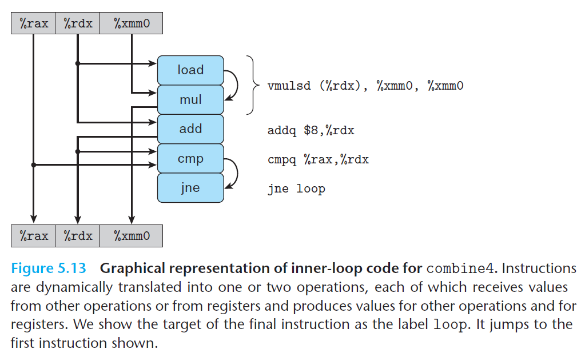

# Ch5 Optimizing Program Performance

## 5.7 Understanding Modern Processors

**5.7.2 An Abstract Model of Processor Operation**

**机器级代码到数据流图**

以下汇编码经过了减少过程调用和消除了不必要的内存应用，其在处理器上的操作步骤、指令和寄存器的对应关系如下图所示：

```assembly
Inner loop of combine4. data_t = double, OP = *
acc in %xmm0, data+i in %rdx, data+length in %rax
 .L25: loop:
 vmulsd (%rdx), %xmm0, %xmm0 Multiply acc by data[i]
 addq $8, %rdx Increment data+i
 cmpq %rax, %rdx Compare to data+length
 jne .L25 If !=, goto loop
```



将循环代码片段的将寄存器分为四类：

1. Read-Only，用作源值，可以当作数据或用于计算内存地址，如上图中的`%rax`；
2. Write-Only，用于数据传送操作的目的寄存器；
3. Local，在循环内部被修改和使用的寄存器，不存在依赖关系，例如，状态码寄存器，用于判断循环的状态，例如上图中的`cmp`和`jne` 指令；
4. Loop，既作为源值由作为目的的寄存器，例如上图中的`%rdx` 和`%xmm0`。

