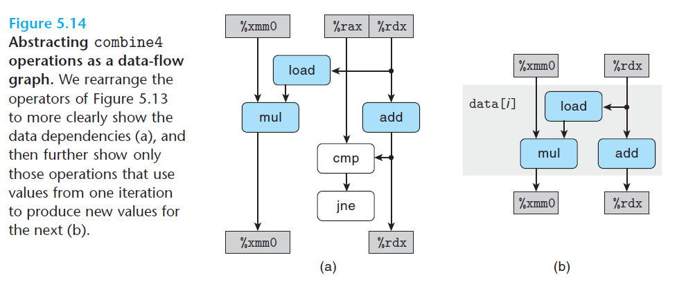

# Ch5 Optimizing Program Performance

## 5.7 Understanding Modern Processors

**5.7.3 An Abstract Model of Processor Operation**

循环中寄存器之间的操作量决定了限制性能的数据相关。

重新排列操作符，可以看到循环程序的关键路径及数据相关。下图中浮点乘法的`load`操作以及每次数组索引计算，为两条数据相链，这两条数据相关链制约了程序的性能。

**其它影响性能的因素**

数据流中的关键路径为程序所需周期数的下界，还存在其它因素：

* 可用功能单元的数量
* 功能单元之间可以传输数据值的数量

