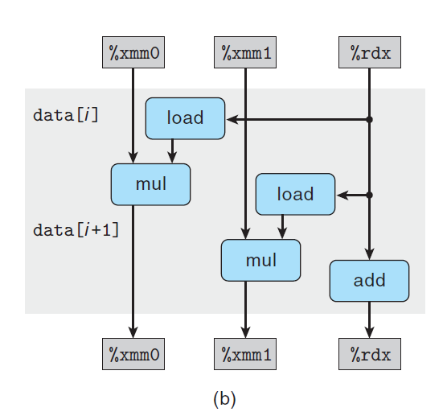

# Ch5 Optimizing Program Performance

## 5.9 Enhancing Parallelism

加法和乘法操作是完全流水线化的，每个时钟周期可以开始一个新操作，而且有些操作可以被多个功能单元执行。目前的代码和优化方法不能利用这种能力，本章介绍了两种提升程序并行性的方法。

**5.9.1 Multiple Accumulators**

对于整数乘法和加法，由于其满足结合律和交换律，可以将一组运算拆分为多个部分，最后合并结果来提升性能。这种方法，利用了 CPU 中的多个功能单元，当拆分次数正好等于功能单元数时，可以使流水线满载，使程序达到吞吐量界限。下图为拆分后程序的关键路径，可以看到有两条独立的关键路径。

> 浮点数的乘法和加法不能满足上述结合，改变其运算顺序很有可能会产生精度问题，甚至溢出问题。大多数编译器保证不会对浮点数代码进行上述变换。

