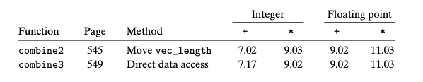
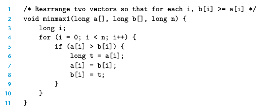
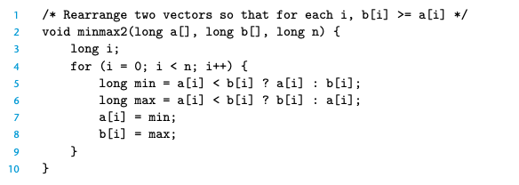

### 5.11.2 Branch Prediction and Misprediction Penalties

3.6.6 中描述了分支预测和预测错误的惩罚 我们现在了解一些细节

speculative execution 中 处理器避免更改任何实际的寄存器或者内存直到真正的outcome产生；如果预测正确，则commit；反之抛弃所有的执行结果，重新进行取指操作。后者发生时，预测失败的惩罚就产生了。

> How, then, can a C programmer make sure that branch misprediction penal- ties do not hamper a program’s efficiency? 

下面是一些原则：
Do Not Be Overly Concerned about Predictable Branches
 比如这种场景下，似乎CPE并没有因为减少了分支而有显著提升，因为对应代码的分支本身就是非常好预测的 在大部分时候，分支预测都是比较准确的

Write Code Suitable for Implementation with Conditional Moves

> Many tests in a program are completely unpredictable, dependent on arbitrary features of the data, such as whether a number is negative or positive. 

命令式

声明式

后者可以让编译器采取 conditional data transfers 而不是 conditional control transfers

