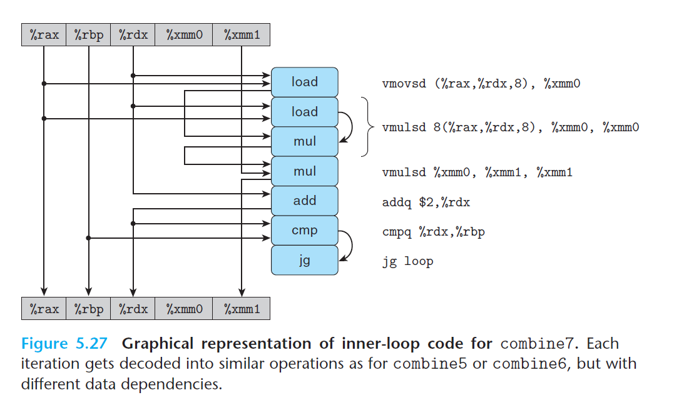
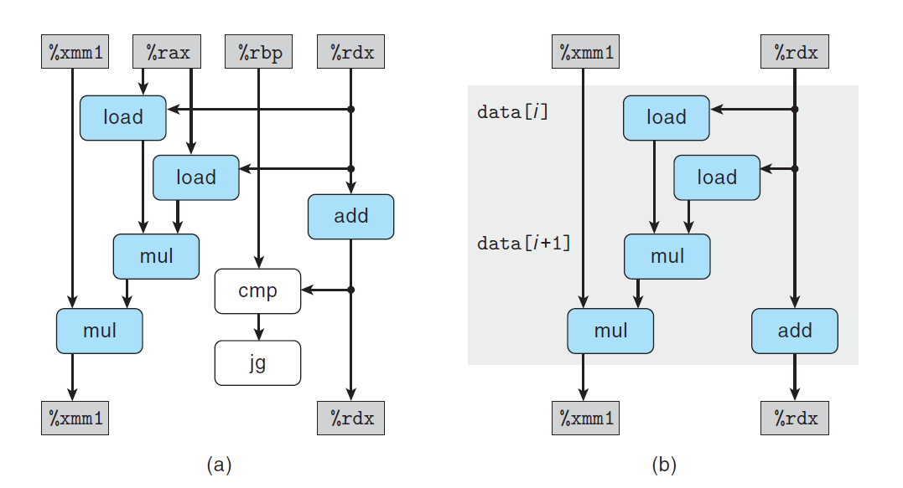

# Ch5 Optimizing Program Performance

## 5.9 Enhancing Parallelism

**5.9.2 Reassociation Transformation**

将 `acc = (acc OP data[i]) OP data[i+1];`操作变换成 `acc = acc OP (data[i] OP data[i+1]);` ，进行重新结合变换操作，改变了和累计变量的合并方式，也能提升性能。

上述方法的例子如下图，译码后的操作顺序如下：连续两个 `load` 操作读取下标为 `i` 和 `i + 1` 的数据，第一个 `mul` 操作将两个数据相乘，第二个 `mul` 将上述结果和 `acc` 累乘。将译码后的指令操作化简后可以得到数据流图，然后组织成循环寄存器的数据相关链，可以看到，n 个元素相乘，关键路径上仅有 n / 2 个操作，使得 CPE 值减少两倍。

> 重新结合变换能减少关键路径上操作的数量，更好的利用功能单元的流水线能力获得更好的性能。但是大多数编译器不会对浮点运算做出重新结合的优化，无法保证浮点运算是可结合的。GCC 会对整数运算执行重新结合优化，但效果并不一定好。因此，使用循环展开和并行积累多个值的方法，是提升程序性能更可靠的方法。

