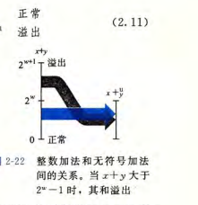
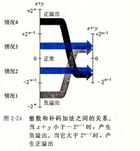

## 2.2整数运算

### 2.2.1 无符号加法

```c++
int uadd_ok(unsigned x, unsigned y){//练习题2.27
    unsigned _x = UINT_MAX ^ x;
    return y > _x;
}
```



### 2.3.2 补码加法

补码正数  + 正数 or 负数 + 负数会溢出



```c++
int tadd_ok(int x, int y){//练习题2.30
    if((x & INT_MIN) != (y & INT_MIN) || !x || !y) return 0;
    if(x > 0 && y > 0){
        int _x = INT_MAX ^ x;
        return y > _x;
    }
    int _x = INT_MAX ^ x;
    y -= INT_MIN;
    return y > x;
}
```

