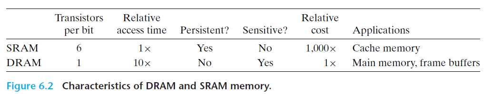
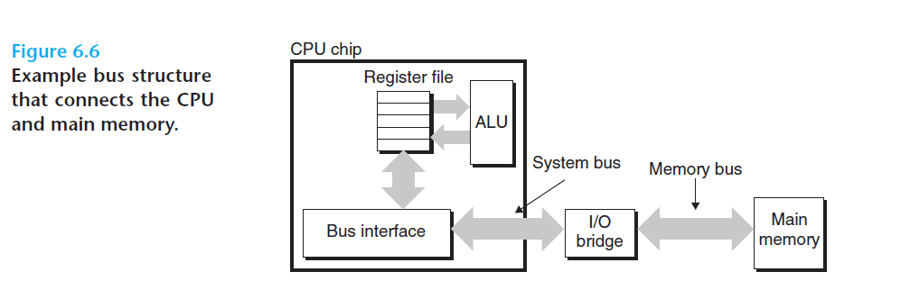
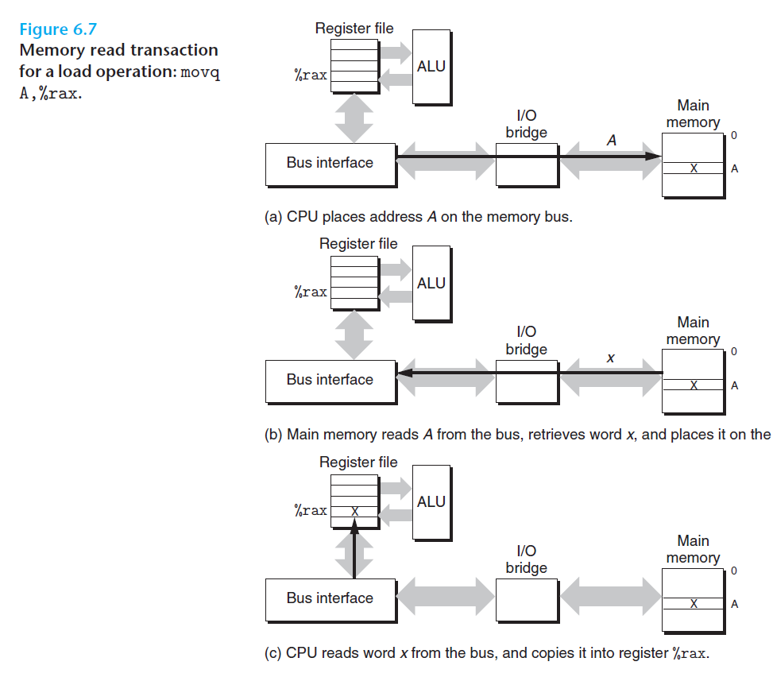

# Ch6 The Memory Hierarchy

## 6.1 Storage Technologies

SRAM 和 DRAM 的区别：

ROM（Read Only Memory）为非易失性存储器的一种，代表有：PROM, EPROM, flash memory, firmware 等。

**主存访问过程：**

CPU 和主存之间的数据传送是通过总线完成的，总线是一组并行的导线，同时带有地址、数据、控制信号。

一般来说，北桥芯片连接 CPU 和主存，南桥芯片连接 CPU 和 I/O 设备。

CPU 读主存数据过程如下图：

