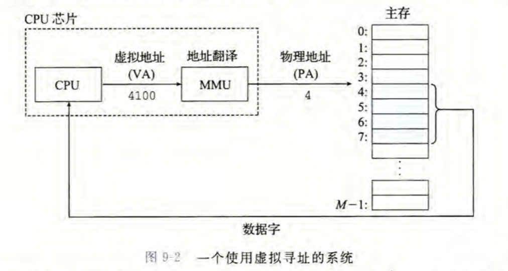
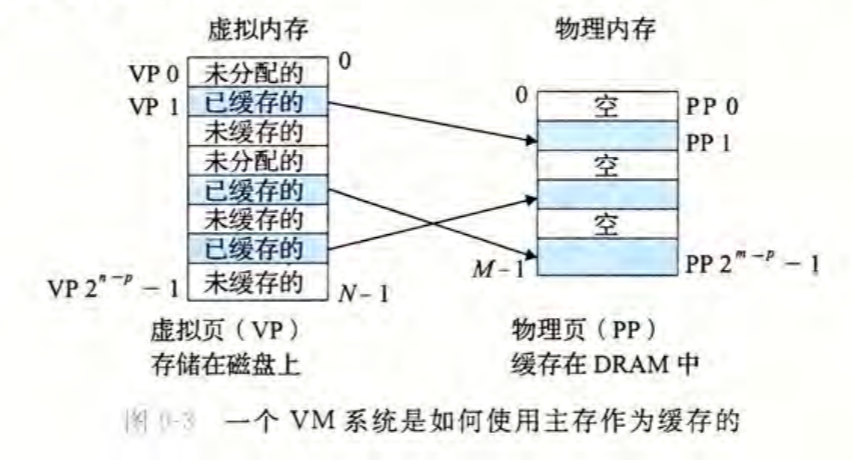
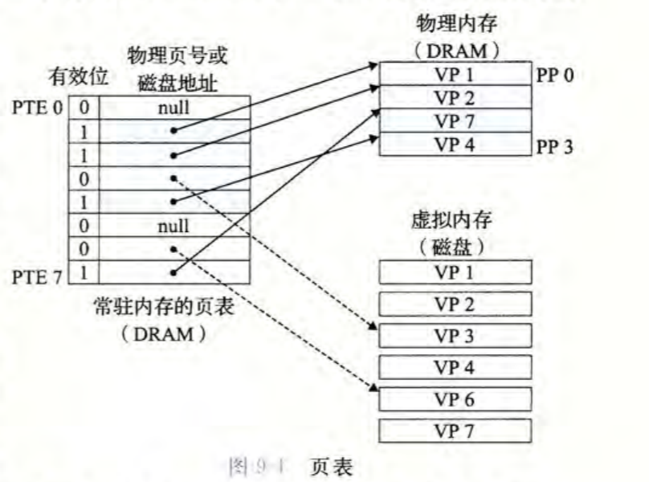

* 虚拟内存(VM)是对真实内存的一种抽象
* charpter 9 从两个角度看待虚拟内存,本章的前一部分描述虚拟内存是如何工作的。后一部分描述的是应用程序如何使用和管理虚拟内存。

### 9.1 物理和虚拟寻址
早期计算机采用物理寻址, 而现代cpu采用虚拟寻址的方式。cpu将虚拟地址发送给MMU, 由MMU翻译为真实的物理地址。

### 9.2 地址空间

系统生成N=2^n个虚拟内存地址即从0到 N-1
实际有M=2^m个虚拟内存地址即从0到 M-1

### 9.3 虚拟内存作为缓存的工具

VM 系统通过将虚拟内存分割为称为虚拟页(Virtual Page, VP)的大小固定的块。每个虚拟页的大小为字节。类似地，物理内存被分割为物理页(Physical Page, PP)大小也为 P 字节(物理页也被称为页帧(page frame))。在任意时刻，虚拟页面的集合都分为三个不相交的子集: 
* 未分配的：VM 系统还未分配(或者创建）的页。未分配的块没有任何数据和它们相关联，因此也就不占用任何磁盘空间。
* 缓存的：当前已缓存在物理内存中的已分配页。
* 未缓存的：未缓存在物理内存中的已分配页。

DRAM 缓存的位置对它的组织结构有很大的影响。DRAM 缓存中的不命中比起 SRAM 缓存中的不命中要昂贵得多.

页表：虚拟内存系统必须有某种方法来判定一个虚拟页是否缓存在DRAM 中的某个地方。

