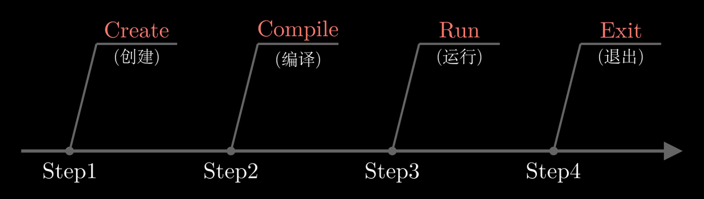
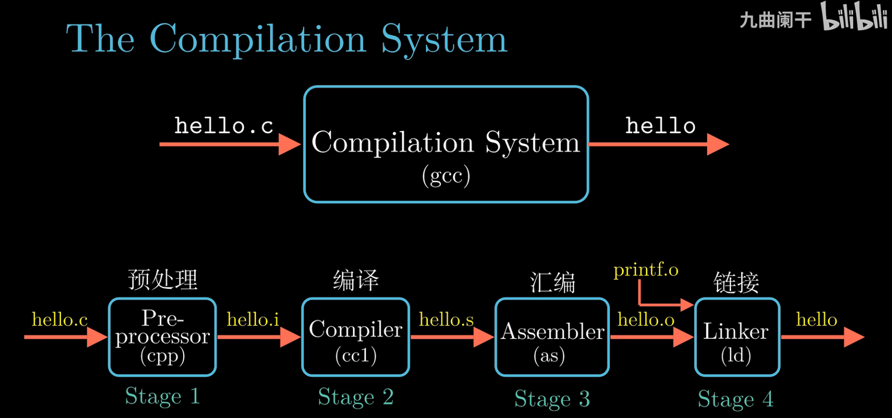
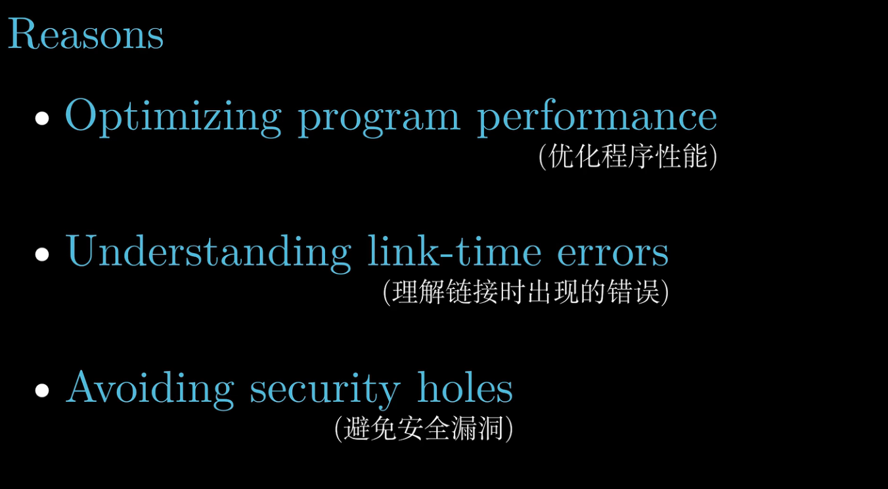

## Chaptor 1. 计算机系统漫游
- What is the Lifetime of Hello Program

  

- How compilation system work?

  

- Why a programmer needs to know how compilation system work?

    - Optimize the performance of a program
      - Q1: Is `switch` much more efficient then multiple `if-else`?
      - Q2: What's the cost of a function call?
      - Q3: Is `while` much more efficient then multiple `for-loop`?
      > Will be answered after studying Chapter 3 and Chapter 5
    - Understanding link-time errors
      - Q1: What's the difference between global variable and local variable?
      - Q2: What's the difference between static lib and dynamic lib?
      > Will be answered after studying Chapter 7
    - Avoiding security issues
      - buffer overflow
        - how to avoid?
          - understand how data and information flow stored based on stack
    
    