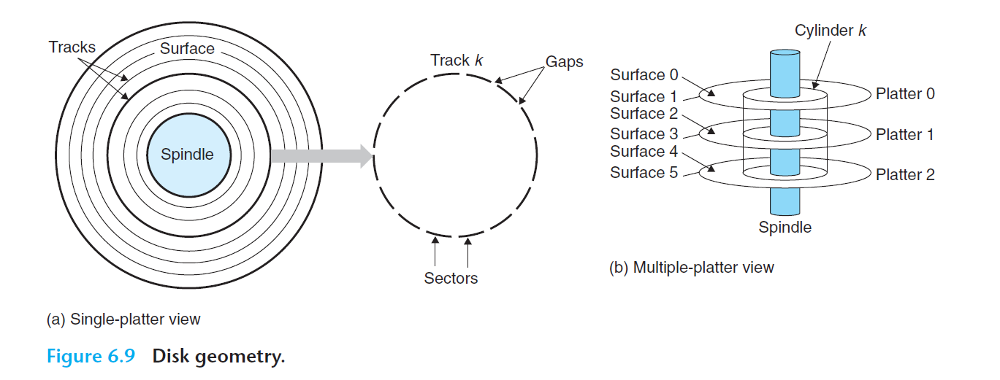
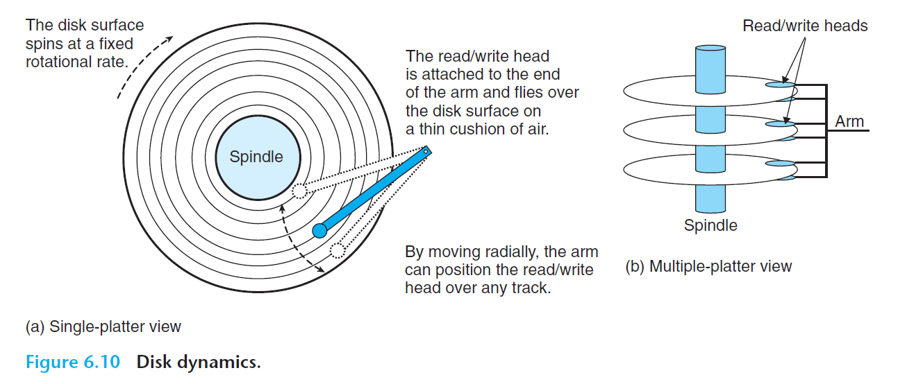

# Ch6 The Memory Hierarchy

## 6.1 Storage Technologies

### 6.1.2 Disk Storage

磁盘数据访问的时间毫秒级，而内存数据访问的时间为纳秒级。

磁盘结构如下图所示，盘片的表面由一组磁道的同心圆组成，每个磁道被划分为一个扇区，每个扇区包含了相等数量的数据位（通常为 512 bytes），这些数据编码在扇区 上的磁性材料之中。此外，扇区会被一些间隙隔开，间隙不存储数据，用于标志扇区的格式化位。

磁盘用读写头来读写存储在磁性表面的位，读写头连接到一个传送壁，以传送壁来完成将读写头定位在盘面上的磁道上。读写头垂直排列，都位于同一个柱面上。

