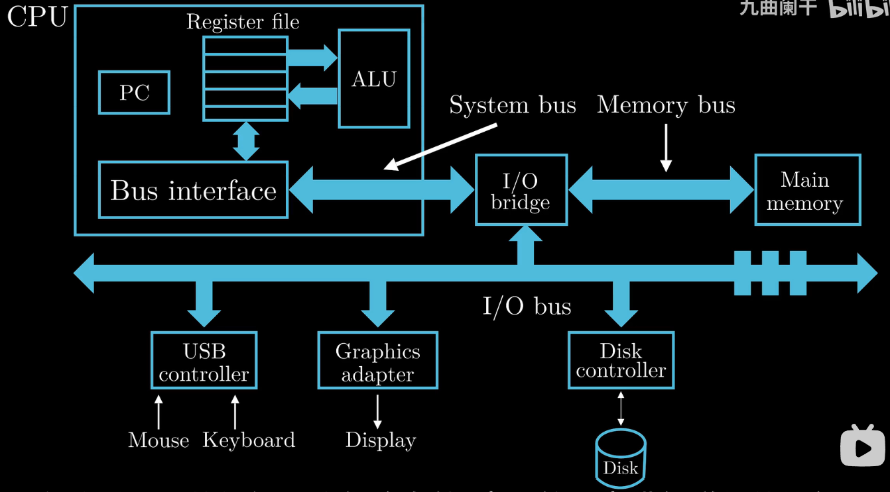
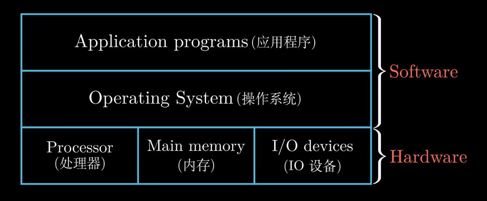
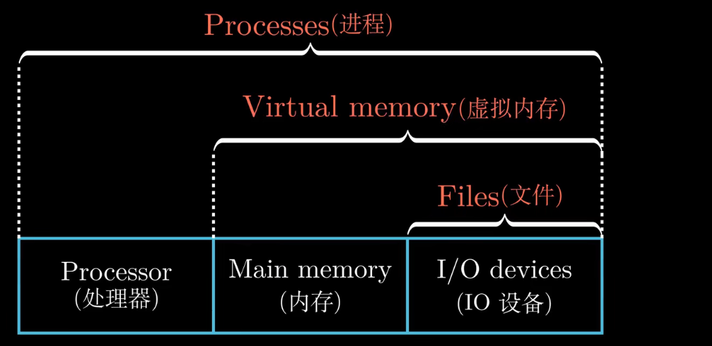
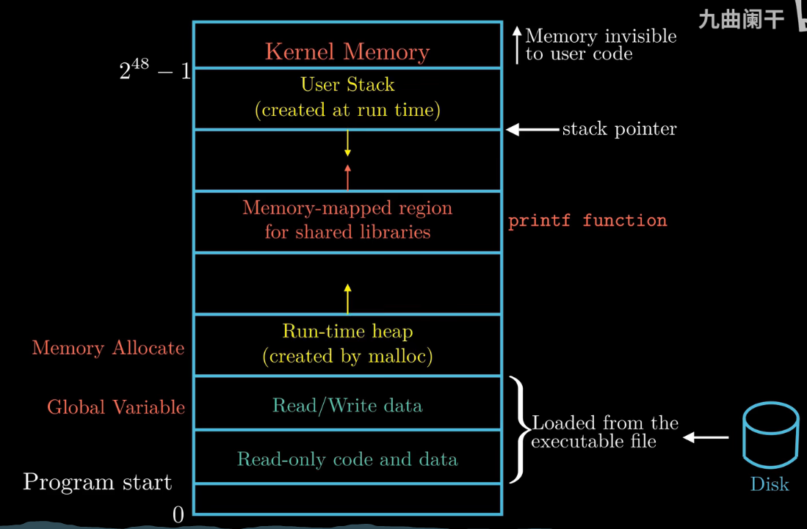
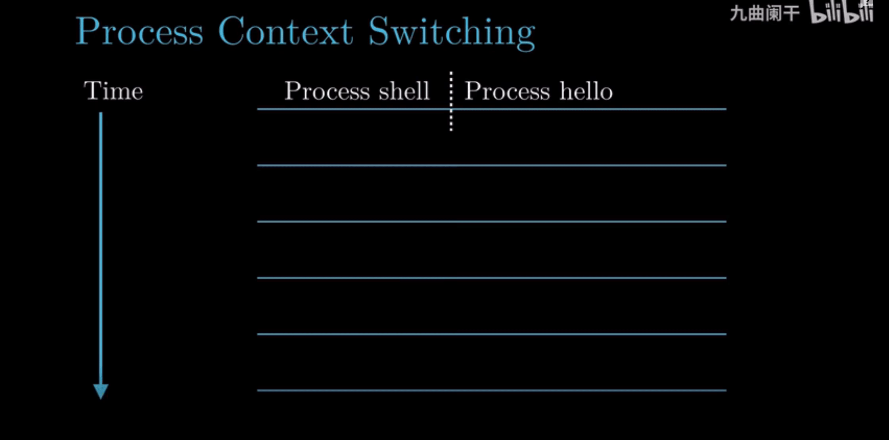
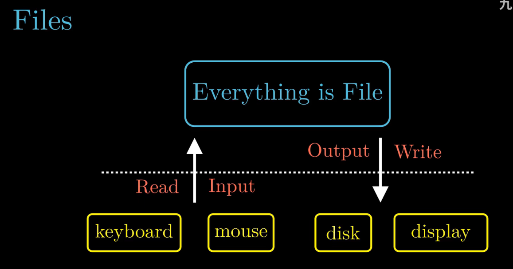

## Chapter 1。 计算机系统漫游
- Hardware organization of a system
  - PC: program count
    - 32-bit: 1 word = 4 Byte
    - 64-bit: 1 word = 8 Byte
    - repeatly update this memory to execute some commands. 
  - Register file
    - ex. How to compute A + B?

    

    

- Why operating system is designed like this?
  - prevent hardward abusement by applications
  - provide uniform machanism to control complicated hardwares

  

- How the context is switched?

  

- Linux: everything is file. Simple but powerful
  - ex 1: same program can run at different disk/os, will learn Unix IO
